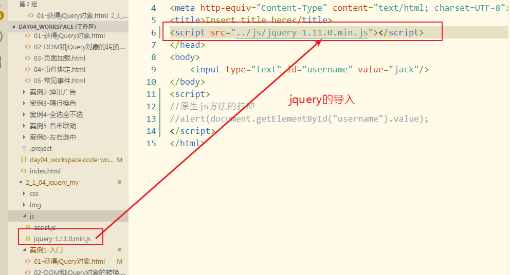
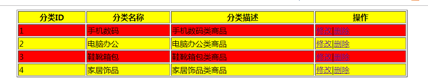
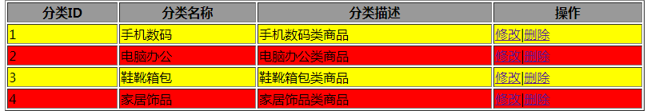
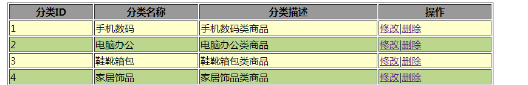
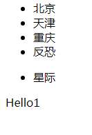
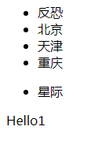
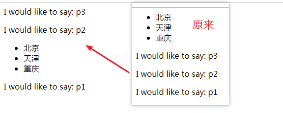
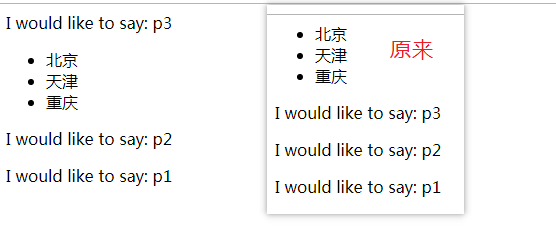
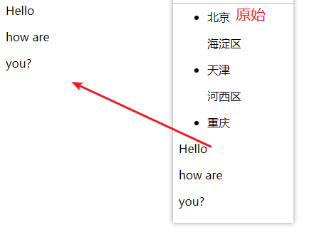
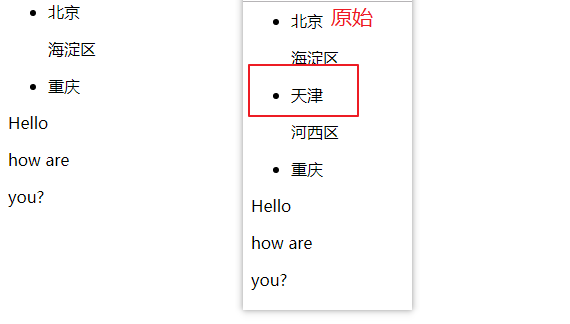

- 学习笔记记录情况
  - 完成
## jQuery

### js类库

对常用的方法和对象进行封装,方便我们使用.
#### jquery对象的导入
```js
<script src="../js/jquery-1.11.0.min.js"></script>
```


#### jquery书写的方式方法

- 原生js的写法

```js
alert(document.getElementById("username").value);
```
- 
```jquery
var $username=$("#username");
alert($username.val());
```
### jQuery案例1_弹窗
#### 技术实现:
1.定时器
2.jQuery
- 案例1_步骤分析
1.页面加载成功之后$(function(){...}) 开始一个定时器 setTimeout();
2.编写展示广告方法 
    * 获取div,然后调用效果方法
    * 设置另一个定时器 隐藏
3.编写隐藏广告的方法
    * 获取div,然后调用效果方法
#### 代码实现
```js
$(function(){
    //开启一个定时器 2秒之后展示div
    setTimeout(showAd,2000);
  });
  //编写展示的方法
  function showAd(){
    //获取div，调试效果
    //$("#ad").show(1000);
    //$("#ad").slideDown(1000);//向下滑出
    $("#ad").fadeIn(1000);
    setTimeout("hideAd()",2000)
  }
  //编写隐藏方法
  function hideAd(){
    //1.方法1,弹出
    //$("#ad").hide(1000);
    //2.方法2,向下拉出
  //$("#ad").slideUp(1000);
    //3.淡出
    $("#ad").fadeOut(1000);
  }
```

***
### jquery和html的整合

jquery是单独的js文件
```js
$("选择器")
或者
jquery("选择器")
```

### dom对象和jquery对象之间的转换

#### dom对象====>jquery对象
```js
$(dom对象)
```
- 例:
```js
//1.获取dom对象
var obj=document.getElementById("username");
//2转化
var $user=$(obj);
alert($user.val());
```
#### jquery对象====>dom对象
- 方法一
```js
jquery对象[index]
```
-方法二
```js
$jquery对象.get(index)
```
```jquery
//2.1方式1
var obj =$u.get(0);
alert(obj);
//2.2方式2
var obj =$u[0];
alert(obj.value);
```
#### 页面加载:
- js的方式
```js
windouw.onload=function(){}
//在一个页面中只可以使用一次
```
- jquery的方式
 
```js
方式1
$(function(){...})
方式2
$(document).ready(function(){});
```
#### 派发事件
```js
$("选择器").click(function(){...})
```
等价于js中的
```js
dom对象.onclick=function(){...}
```
##### 例
```js
onload=function(){
				alert(12);
			}
      //次用法不能重复

			$(function(){
				alert("abc")
			})
			$(function(){
				alert("abc2")
			})
			$(function(){
				alert("abc3")
			})可以重复
```
#### 需要掌握的事件
1.focus
2.blur
3.submit
4.change
5.click
##### 例
```js
	$(function(){
			//派发事件
			$("#bid").click(function(){
				alert(123)
			})
		})
```
### jquery中的效果
- 隐藏或展示
  - show(毫秒数)
  - hide(毫秒数)
#### show和hide
```js
$(function(){
			$("#b1").click(function(){
				$("#b1Div").hide(1000);
				$("#b1Div").hide();
			})
		})
```
#### toggle
用于绑定两个或多个事件处理器函数，以响应被选元素的轮流的 click 事件。
如果元素是可见的，切换为隐藏的；如果元素是隐藏的，切换为可见的。
- 滑入或滑出
  - slideDown(毫秒数:向下滑入)
  - slideUp(毫秒数:向上滑出)
#### 滑入或滑出
```js
			//滑出/滑入b2Div
			$("#b2").click(function () {
				//$("#b2Div").slideUp(2000);
				$("#b2Div").slideToggle(1000);

			})
```
- 淡入或淡出
  - fadeIn(毫秒数):淡入
  - fadeOut(毫秒数):淡出
#### 淡入或淡出 
```js
			//出/淡入b3Div
			$("#b3").click(function(){
				$("#b3Div").fadeOut (1000);
			})
	
```
####  
### 选择器总结
#### 基本选择器★
1. $("#id值")---id选择器
2. $(".class值")---class选择器
3. $("标签名")---标签选择器
4. $("*")---全选所有选择器
5. $("#id值,.class值")---获取多个选择器,用逗号隔开
```js
 //<input type="button" value="选择 id为 one 的元素." id="btn1"/>  
 		 $("#btn1").click(function(){
 		 	$("#one").css("background-color","#ff0");
 		 });
		//<input type="button" value="选择 class 为 mini 的所有元素." id="btn2"/>
		$("#btn2").click(function(){
			$(".mini").css("background-color","#ff0");
		});
		 // <input type="button" value="选择 元素名是 div 的所有元素." id="btn3"/>
		 $("#btn3").click(function(){
			$("div").css("background-color","#ff0");
		});
		 // <input type="button" value="选择 所有的元素." id="btn4"/>
		 $("#btn4").click(function(){
			$("*").css("background-color","#ff0");
		});
		 //<input type="button" value="选择 所有的span元素和id为two的元素." id="btn5"/>
		 $("#btn5").click(function(){
			$("span,#two").css("background-color","#ff0");
```

#### 层次选择器

1. a b---a的所有b后代
2. a>b---a的所有b孩子
3. a+b---a的下一个兄弟(大弟弟)
4. a~b:a的所有兄弟
```js
// 		<input type="button" value="选择 body内的所有div元素." id="btn1"/>
		$("#btn1").click(function(){
			$("body div").css("background-color","#f0f");
		});
//		  <input type="button" value="在body内,选择子元素是div的。" id="btn2"/>
		$("#btn2").click(function(){
			$("body>div").css("background-color","#f0f");
		});
//		  <input type="button" value="选择 id为one 的下一个div元素." id="btn3"/>
		$("#btn3").click(function(){
			$("#one+div").css("background-color","#f0f");
		});
//		  <input type="button" value="选择 id为two的元素后面的所有div兄弟元素." id="btn4"/>
		$("#btn4").click(function(){
			$("#two~div").css("background-color","#f0f");
		});
 	})
```

#### 基本过滤选择器★

1. `:frist`第一个
2. `:last`最后一个
3. `:odd`索引奇数
4. `:even`索引偶数
5. `:eq(index)`指定索引
6. `:gt(index)`大于(>)
7. `:lt(index)`小于(<)

```js
// 		 <input type="button" value="选择第一个div元素." id="btn1"/>
		$("#btn1").click(function(){
			$("div:first").css("background-color","#0f0");
		});
//		  <input type="button" value="选择最后一个div元素." id="btn2"/>
		$("#btn2").click(function(){
			$("div:last").css("background-color","#0f0");
		});
//		  <input type="button" value="选择索引值为偶数 的div元素." id="btn3"/>
		$("#btn3").click(function(){
			$("div:even").css("background-color","#0f0");
		});
//		  <input type="button" value="选择索引值为奇数 的div元素." id="btn4"/>
		$("#btn4").click(function(){
			$("div:odd").css("background-color","#0f0");
		});
//		  <input type="button" value="选择索引值等于3的div元素." id="btn5"/>
		$("#btn5").click(function(){
			$("div:eq(3)").css("background-color","#0f0");
		});
//		  <input type="button" value="选择索引值大于3的div元素." id="btn6"/>
  $("#btn6").click(function(){
    $("div:gt(3)").css("background-color","#0f0");
  });
});
```
#### 内容过滤器

`:has("选择过滤器")`:包含指定选择器的元素
```js
 // <input type="button" value="选取含有class为mini元素 的div元素." id="btn1"/>
$("#btn1").click(function(){
  $("div:has('.mini')").css("background-color","#0ff");
});
});
```

#### 可见过滤

`:hidden`在页面不展示元素,一般指input type="hidden"和display:none
```js
$(function(){
     $("#b1").click(function(){
   //获取文本隐藏
  // alert($("input:hidden").size());
   $("input:hidden").each(function(index,dom){
     //alert(this.value);
     //alert($(this).val());
     //alert(index);
     //alert(dom.value);
   });
     });
   	$("#b2").click(function(){
       $.each($("input:hidden"),function(){
         alert($(this).val());
       })
     })
 	});
```
`:visible`:
```js
// 		 <input type="button" value=" 选取所有可见的div元素"  id="b1"/>
$("#b1").click(function(){
  $("div:visible").css("background-color","#f0f");
});
//		<input type="button" value=" 选取所有不可见的div元素, 利用 jQuery 中的 show() 方法将它们显示出来"  id="b2"/>
$("#b2").click(function(){
  $("div:hidden").css("background-color","#f0f").show(1000);
});
});
```

#### 属性过滤器★

`[属性名]`
`属性名="值"`
```js
// 		<input type="button" value="选取含有 属性title 的div元素." id="btn1"/>
		$("#btn1").click(function(){
			$("div[title]").css("background-color","#ff0");
		});
//		<input type="button" value="选取 属性title值等于“test”的div元素." id="btn2"/>
  $("#btn2").click(function(){
    $("div[title='test']").css("background-color","#ff0");
  });
});
```
#### 表单过滤:

`:input`所有的表单子标签 `input` `select` `textare` `button`

```js
// <input type="button" value="选取所有的表单子元素" id="btn1"/><br />
$("#btn1").click(function(){
  //alert($("#form1 :input").size());
  //alert($("#form1 :input").length);
  alert($("#form1 input").size());
});
```
***

### 案例2_隔行换色
#### 技术分析
1.页面加载成功
2.获取所有的奇数行 添加一个css
3.获取所有的偶数行 添加一个css
#### 代码实现
```js
<script>
			$(function(){
				$("tr:odd").css("background-color","red");
				$("tr:even").css("background-color","yellow");
			})
```
- 效果


```js
$(function(){
				$("tr:gt(0):odd").css("background-color","red");
				$("tr:gt(0):even").css("background-color","yellow");
			})
```
- 效果

```js
$(function(){
				$("tr:gt(0):odd").addClass("odd");
				$("tr:gt(0):even").addClass("even");
			})
```
- 效果

***

### 属性和css操作总结

#### 对属性的操作
`attr():`设置或获取元素的属性
- 方法1
  - `attr("属性名称")`---获取
- 方法2
  - `attr("属性名称","值")`_--设置一个属性
- 方法3
  - 设置多个属性
```js
  attr({
      "属性1":"值1",
      "属性2":"值2"
	})
	
#### 代码展示


//1.1给username添加title属性
			var $username = $("[name='username']");
			$username.attr("title", "姓名");
			//1.2获取username的title属性
			alert($username.attr("title"));
			//1.3给username添加value和class属性
			$username.attr({
				"value": "许多多",
				"class": "textclass"
			});
			//1.4删除username的class属性
			$username.removeAttr("class");
			//2.1给username添加一个名为textClass的样式
			$username.addClass("textclass");
			//2.2删除username的名为textClass的样式
			$username.removeClass("textclass");
			//4.1 给div添加边框样式
			var $div = $("div");
			$div.css("border", "1px solid red");
			//4.2 获取div的表框样式
			alert($div.css("border"));
			//4.3 给div添加多种样式
			$div.css({
				"width": "100px",
				"height": "100px",
				"background-color": "yellow"
			});

			//5 获取div的位置
			alert($div.offset().left())
			//6 获取div的高和宽
			//alert($div.width());
```

```
- `removeAttr`("属性名称")---移除指定属性
- 添加class属性的时候
- attr("class","值");
- `addClass("指定的样式值")`---等于`attr("class","指定的样式值")`;
#### 对css操作:操作元素的style属性
- `css()`:获取或者设置css样式
- 方式1:获取`css("属性名")`
- 方式2:设置一个属性值:`css("属性名","值",)`
- 方式3:设置多个
```js
css({
"属性1":"值1",
"属性2":"值2"
})
```
#### 代码展示
```js
$(document).ready(function () {
    //1.1给username添加title属性
    var $username = $("[name='username']");
    $username.attr("title", "姓名");
    //1.2获取username的title属性
    alert($username.attr("title"));
    //1.3给username添加value和class属性
    $username.attr({
      "value": "许多多",
      "class": "textclass"
    });
    //1.4删除username的class属性
    $username.removeAttr("class");
    //2.1给username添加一个名为textClass的样式
    $username.addClass("textclass");
    //2.2删除username的名为textClass的样式
    $username.removeClass("textclass");
    //4.1 给div添加边框样式
    var $div = $("div");
    $div.css("border", "1px solid red");
    //4.2 获取div的表框样式
    alert($div.css("border"));
    //4.3 给div添加多种样式
    $div.css({
      "width": "100px",
      "height": "100px",
      "background-color": "yellow"
    });

    //5 获取div的位置
    alert($div.offset().left())
    //6 获取div的高和宽
    //alert($div.width());
  });	
```

#### 获取元素的尺寸：

`width`
`height`

*** 
### 案例3_全选全不选

####  需求
就是降内容中的复选框的选中状态的最上面的复选框状态保持一致
#### 步骤分析
1. 确定事件 复选框的单击事件
2. 函数中
   a. 获取该复选框的选择状态 attr(获取不了checked属性)|prop
   b.获取所有的复选框修改他们的状态
#### 代码展示
```js
$(function () {
  $("#selectAll").click(function () {
    //1.获取当前元素的选中状态 this在function中代表的是当前的dom对象
    //alert(this.checked);
    //alert($(this).attr("checked"));//===>undefined
    //alert($(this).prop("checked"));
    //2.获取所有的复选框 让其状态和当前元素的选中状态保持一致
    $(".itemSelect").prop("checked",$(this).prop("checked"));
  })
});
```


### 案例4_省市联动
  #### 步骤分析:
  1.确定事件:省份的下来选变化的时候 change
  2.编写函数:
    a. 获取当前省的value值
    b. 通过数组获取该省下的所有市 返回值:数组
    c. 遍历数组,拼装成option元素,追加到时下拉选择即可
  * 注意:每次改变的时候初始化的值

#### 代码实现

```js
	$(function () {
		$("[name='pro']").change(function () {
			//获取市的下拉选项
			var $city = $("[name='city']");
			//初始化
			$city.html($("<option>").html("-请选择-"));
			var pro = $(this).val();
			//获取所有城市的数组
			var cities = $(arr[pro]);
			alert(cities);
			//遍历数组,拼装成option 追加到市下拉选中
			cities.each(function () {
				$city.append("<option>" + this + "</option>")s
			})

		})
	});
```
***

#### 技术分析
  - 遍历数组
  `数组.each(遍历数组,function(){})`
  `$.each(遍历数组,function(){})`
  - 注意
  `each`的`function`中可以加两个参数`index`和`dom`
  - `index`是当前遍历的索引
  - `dom`指代是当前遍历的dom对象(开发中一般使用this即可)

  ***

#### 设置获取标签体的内容
- html()
- text()
- xxx():获取标签体的内容
- xxx(...);设置标签体的内容
- 设置的区别:
  - html:会把字符串解析
  - text:只做为普通的字符串
- 获取的区别:
  - html:获取的html源码
  - text:获取知识页面展示的内容
  
  ***
#### 代码展示
```js
	$(document).ready(function(){
		var $username=$("[name='username']");
		$username.prop("value","许木木");
		//3.1 获取 username的value属性的值
		// alert($username.val());
		//3.2 设置 username的默认值为"许多多"
		$username.val("许多多");
		//alert($username.val());
		//3.3通过html获取div标签体的内容
			var $div=$("div");
			//alert($div.html());
		//3.4通过html设置div标签体的内容
		//$div.html("已满18岁请戴墨镜");
		
		//3.5通过text获取div标签体的内容
		//alert($div.text())	;
		//3.6通过text设置div标签体的内容
		//$div.text("已满18,请带墨镜");
		
		//3.7 两者设置值的区别
		// $div.html("<a href='#'>我是一个超链接</a>");//就是一个超链接
		//$div.html($("<a href='#'>").html("我"));
			$div.text("<a href='#'>我是一个超链接</a>");//返回<a href='#'>我是一个超链接</a>
		//3.8 两者获取值的区别
		alert($("#sp").html());//获取源码
		alert($("#sp").text());//获取展示内容
		
		});	"
```

* 创建一个元素:`$("<标签></标签>")
  
  ***
#### 内部操作:
- 内部插入
  - `a.append(c)`:将c插入到a的内部(标签体)后面
```JS
	$(document).ready(function () {
			//0.获取两个元素
			var $city = $("#city");
			var $fk = $("#fk");
			//1.在city的后面内部追加 反恐
			$city.append($fk);
		});
```

  - `a.perpend(c)`:将c插入到a1的内部的前面
```js
	$(document).ready(function () {
			//0.获取两个元素
			var $city = $("#city");
			var $fk = $("#fk");
			//2.在city的前面内部插入 反恐
			$city.prepend($fk);
		});
```

  - `appendTO`
  - `prependTo`
- 外部插入
  - `a.after(c)`:将c放到a的后面
```js
$(document).ready(function(){
			//获取两个元素
			var $city=$("#city");
			var $p2=("#p2");
		//1.在 p2 的后面插入 city
		$p2.after($city);
		});
```

  - `a.befofe(c)`:将c放到a的前面
```js
		$(document).ready(function(){
			//获取两个元素
			var $city=$("#city");
			var $p2=$("#p2");
		//2.在 p2 的前面插入 city
		 $p2.before($city);
    });
```

  - `a.insertAfter(c)`
  - `a.insertBefore(c)` 
- 删除
  - `empty()`清空元素
```js
		$(document).ready(function(){
		//1.清空ul
	$("#city").empty();
```

  - `remove()`删除元素
```js

```

  
  ***

### 案例5-左右移动

#### 步骤分析
1. 确定事件 单击事件
2. 编写函数
   a. 移动第一:
    - 右边的下拉选追加一个
    - 左边的选中的第一个
   b. 移动多个:
    - 左边选中的 追加到右边的下拉选择中
   c. 移动全部: 
    - 将左边的所有option追加到右边的下拉选择中
#### 代码展示
```js
//移动一个
	$(function () {
		$("#toRight1").click(function () {
			$("#left>option:selected:first").appendTo($("#right"));
		})
		//移动多个
		$("#toRight2").click(function () {
			$("#right").append($("#left option:selected"));
		});
		//移动全部
		$("#toRight3").click(function () {
			$("#right").append($("#left option"));
		});
	})


```


		****

#### 技术分析

- 表单对象属性过来器选择
    - `:enable`可用的
    - `:disable`不可用的
    - `:checked`选中的(针对单选框和复选框)
    - `:selected`选中的(针对于下拉选)

#### 代码展示

```js
```js
    $(function () {
      //   <button id="btn1">对表单内 可用input 赋值操作.</button>
      $("#btn1").click(function () {
        $("input:enabled").val("我们来自kg");
      })
      // <button id="btn2">对表单内 不可用input 赋值操作.</button>
      $("#btn2").click(function () {
        $("input:disabled").val("womshi");
      })
      // <button id="btn3">获取多选框选中的个数.</button>
      $("#btn3").click(function () {
        // alert($("input[ name='newsletter']:checked").size());
        alert($("input[name='newsletter']:checked").size());
      })

      // <button id="btn4">获取下拉框选中的个数.</button	
      $("#btn4").click(function () {
        alert($(":selected").size());
      })
    });
```


