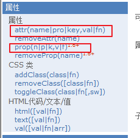

## jQuery

### js类库

对常用的方法和对象进行封装,方便我们使用.
### jQuery案例1_弹出窗口

- 技术实现:
1.定时器
2.jQuery
- 案例1_步骤分析
1.页面加载成功之后$(function(){...}) 开始一个定时器 setTimeout();
2.编写展示广告方法 
    * 获取div,然后调用效果方法
    * 设置另一个定时器 隐藏
3.编写隐藏广告的方法
    * 获取div,然后调用效果方法

***
### jquery和html的整合
jquery是单独的js文件
```js
$("选择器")
或者
jquery("选择器")
```

### dom对象和jquery对象之间的转换

#### dom对象====>jquery对象
```js
$(dom对象)
```
#### jquery对象====>dom对象
- 方法一
```js
jquery对象[index]
```
-方法二
```js
$jquery对象.get(index)
```
#### 页面加载:
- js的方式
```js
  windouw.onload=function(){}
  //在一个页面中只可以使用一次
```
- jquery的方式
 
```js
方式1
$(function(){...})
方式2
$(document).ready(function(){});
```
#### 派发事件
```js
$("选择器").click(function(){...})
```
等价于js中的
```js
dom对象.onclick=function(){...}
```
#### 需要掌握的事件
1.focus
2.blur
3.submit
4.change
5.click
#### jquery中的效果
- 隐藏或展示
  - show(毫秒数)
  - hide(毫秒数)
- 滑入或滑出
  - slideDown(毫秒数:向下滑入)
  - slideUp(毫秒数:向上滑出)
- 淡入或淡出
  - fadeIn(毫秒数):淡入
  - fadeOut(毫秒数):淡出
### 选择器总结
#### 基本选择器★
1. $("#id值")---id选择器
2. $(".class值")---class选择器
3. $("标签名")---标签选择器
4. $("*")---全选所有选择器
5. $("#id值,.class值")---获取多个选择器,用逗号隔开
#### 层次选择器
1. a b---a的所有b后代
2. a>b---a的所有b孩子
3. a+b---a的下一个兄弟(大弟弟)
4. a~b:a的所有兄弟
#### 基本过滤选择器★
1. `:frist`第一个
2. `:last`最后一个
3. `:odd`索引奇数
4. `:even`索引偶数
5. `:eq(index)`指定索引
6. `:gt(index)`大于(>)
7. `:lt(index)`小于(<)

#### 内容过滤器
`:has("选择过滤器")`:包含指定选择器的元素

#### 可见过滤
`:hidden`在页面不展示元素,一般指input type="hidden"和display:none
`:visible`:

#### 属性过滤器★
`[属性名]`
`属性名="值"`
#### 表单过滤:
`:input`所有的表单子标签 `input` `select` `textare` `button`

***

### 案例2_隔行换色
#### 技术分析
1.页面加载成功
2.获取所有的奇数行 添加一个css
3.获取所有的偶数行 添加一个css

***

### 属性和css操作总结

#### 对属性的操作
`attr():`设置或获取元素的属性
- 方法1
  - `attr("属性名称")`---获取
- 方法2
  - `attr("属性名称","值")`_--设置一个属性
- 方法3
  - 设置多个属性
```js
  attr({
      "属性1":"值1",
      "属性2":"值2"
  })
```
- `removeAttr`("属性名称")---移除指定属性
- 添加class属性的时候
- attr("class","值");
- `addClass("指定的样式值")`---等于`attr("class","指定的样式值")`;
#### 对css操作:操作元素的style属性
- `css()`:获取或者设置css样式
- 方式1:获取`css("属性名")`
- 方式2:设置一个属性值:`css("属性名","值",)`
- 方式3:设置多个
```js
css({
"属性1":"值1",
"属性2":"值2"
})
```

#### 获取元素的尺寸：

`width`
`height`

*** 

案例4_省市联动
- 步骤分析:
  1.确定事件:省份的下来选变化的时候 change
  2.编写函数:
    a.获取当前省的value值
    b.通过数组获取该省下的所有市