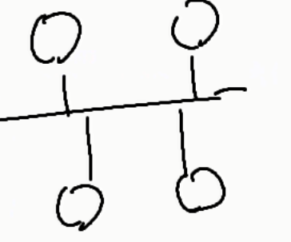
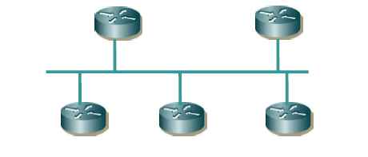
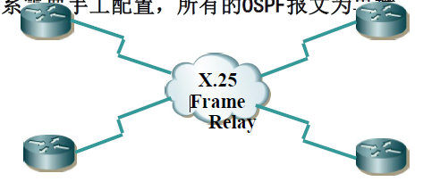
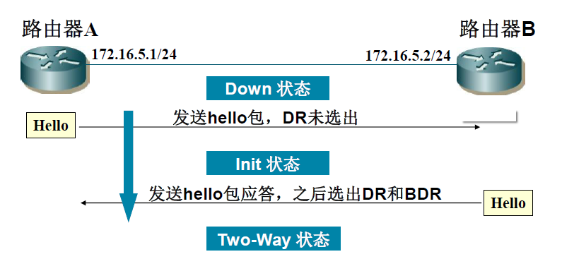
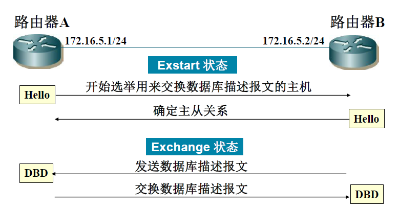
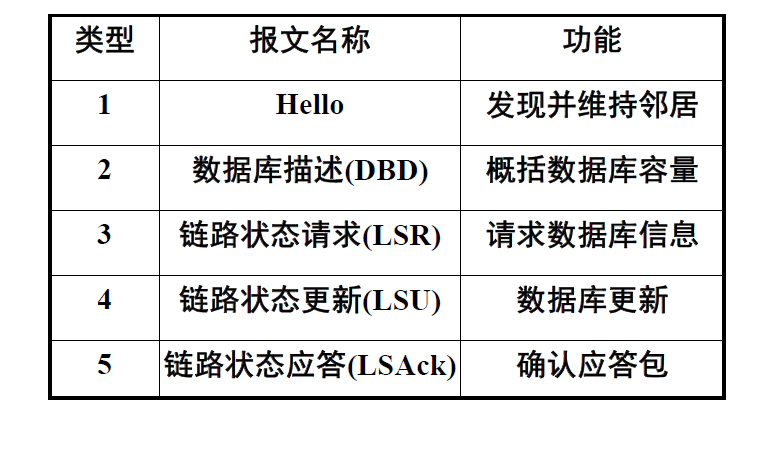
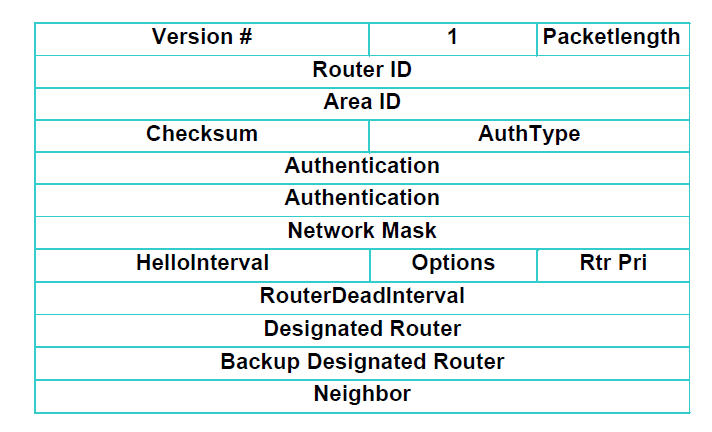
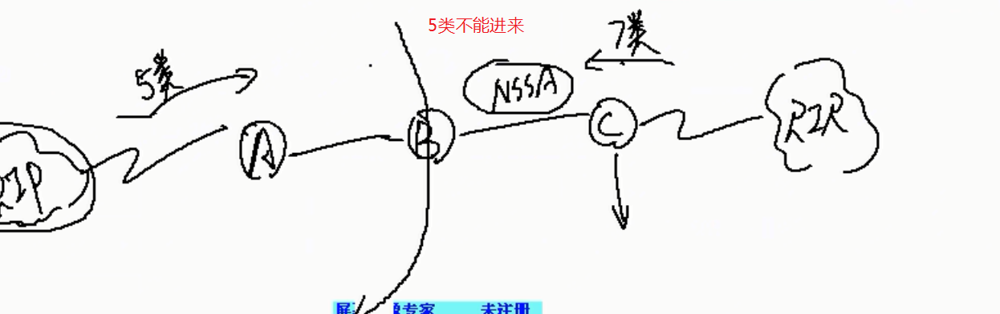
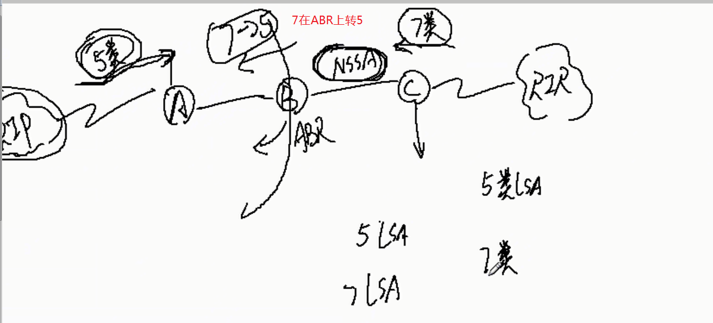
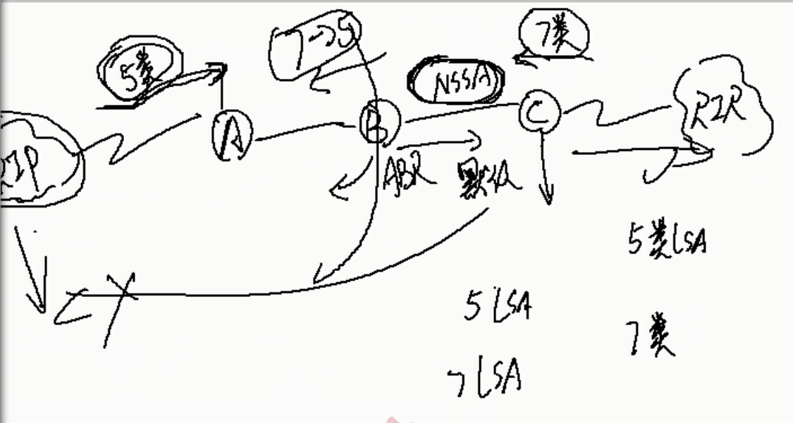

# 高级网规08课-OSPF路由
## OSPF协议特性
- OSPF(开放式最短路径优先)
- OSPF：Open Shortest Path First
- 内部网关路由协议
- 链路状态路由协议
- 基于SPF算法
- 支持可变长子网掩码VLSM
- 具有更快的收敛速度(RIP是周期性更新,OSPF是触发式更新)
- OSPF是一种典型的内部网关路由协议（Interior Gateway Protocol，IGP），一般用于同一个路由域内，在这里，路由域是指一个自治系统（Autonomous System，AS）内决策路由。
-  自治系统是指一组通过统一的路由政策或路由协议互相交换路由信息的网络。
## 链路状态路由协议
- OSPF是一种链路状态路由协议。这意味着路由选择的变化基于网络中路由器物理连接的状态与速度，并且变化被立即广播到网络中的每一个路由器。
- 链路状态指的是一个路由器的局部信息状态、路由器相连的网络状态信息、外部状态信息等。
- 所有的OSPF路由器都维护一个相同的描述链路状态的数据库(LSDB )。
- OSPF将LSA（LinkState Advertisement，链路状态广播数据包）传送给在**某一区域内**的所有路由器。
## SPF基本概念—路由器标识
- 路由器标识(必须的)：
- 如果OSPF网络无法建立邻居有可能是路由器表示相同了
该路由器上最高的LOOPBACK地址
若无回环地址，则优先使用最高位IP地址
## OSPF基本概念—DR和BDR
OSPF建立连接是hello报文
DR：在一个广播性的、多接入的网络中，存在一个指定路由器（Designated Router）。
- DR的作用：
与所有其他邻居同步(节省网络开销)产生network lsa用以描述网络链路状态
- BDR的作用：
做为DR的备份，在DR失效时接管它。
- DR和BDR的选举
  1. 优先级默认为1
  2. 优先级相同的选择rootID的选举到ip的选举,根端口选举
  - 基于网段的选举
  
- 多路访问网络中DR（指定路由器）的设计思想是使邻接的数目减少
- 多路访问网络中路由器只与DR和BDR建立邻接。
- 优先级最高的路由器做为DR。
- 一旦DR选出，其他路由器无法替代，除非这个DR失效

## OSPF网络类型
### OSPF有4种网络类型或模型
- 广播型
  
  广播型网络：是一种具有多个访问设备的网络，同时可连多于两个设备，例如以太网
  1. 需要进行DR/BDR 的选举
  2. 所有的非DR/BDR路由器和DR/BDR 形成完全邻接关系
  3. DROTHER 通过DR/BDR 交换信息
   
- 点到点
  
  点到点网络：如E1线路，是连接单独一对路由器的网络。这种网络上的邻居间总是可以形成邻接。
  1.适用于部分互连或星形拓扑结构里
  2.不需DR,只使用单独的一个子网
  3.自动发现邻居
  4.LSU 包被发送到每个邻居路由器的接口
  
- NBMA网络(非广播多路访问)
  1. NBMA(Non-Broadcast Multi-Access)网络：可以连多个设备的网络，但是没有广播能力，例如frame relay，x.25，ATM
  2. 一个设备发出的报文不会被所有的设备收到
  3. 所以，OSPF路由器要选择DR和BDR
  4. **邻居关系**需要手工配置，所有的OSPF报文为单播
  
   
  

- 点到多点网络(属于NBMA网络)模型上不太一样
- 点到多点非广播(P2MP)
  - 多个点到点网络(不需要选举DR)
  - 不选举DR和BDR

### OSPF基本概念
- OSPF传递路由条目都是由LSA携带的
- OSPF可以划分区域
### OSPF协议工作流程
- 与邻居形成完全邻接关系
——发现邻居
——双向通信
——数据库同步
- 将链路状态数据库更新扩散给其他路由器
- 路由器计算最短路径树，生成路由表。
### 邻接如何形成
 

OSPF协议号为 **89**
### OSPF报文类型

### hello报文

**建立OSPF的必要前提**
1. ID不能相同
2. 接口区域要相同area要相同
3. 验证要通过(认证要相同)
4. hello时间相同(每种网络类型有不同的网络实践)
   1. 点到点hello时间是10s, 超时40s
   2. 广播hello时间是10s, 超时40s
   3. NBMAhello时间是30s, 超时120s
   4. P2MPhello时间是30s, 超时120s
5. 特殊区域认识相同

### 路由器按工作分类
ABR区域间路由器
不同网络时间通讯需要重新发布
ASBR自治区域 路由器
### 链路状态通告（LSA）分类
- 类型1:router LSA(路由器链路状态宣告)
  - Link ID:接口连接的链路
  - 只在两个路由之间传播
  - 
- 类型2:network LSA(网络链路状态宣告)
  - DR和BDR产生的
  - 描述的DR和BDR的链路状态
  - 只能在所属的区域内传播(不能穿越ABR区域间路由器)
- 类型3/4:summary LSA(网络/路由器汇总链路状态宣告)
  - 3类的LSA聚合的LSA
  - 谁产生的:ABR
  - 汇聚路由是在路由发路由
  - OSPF路由汇聚只是在ABR上汇聚,汇聚的是OSPF域内的路由
  - 描述的信息:所连接的某个区域内网段的聚合路由,或说是目的路由(目的网段的路由信息)
  - 类型4
    - 如果路由目的为一个ASBR，则生成Type4 LSA。它的链路状态ID为目的ASBR的RID。
      - 5类产生的RID不变化
      - 7类的RID变化
      - 4类主要记录RID的变化和承载类
- 类型5:AS external LSA(自治系统外部链路状态宣告)
  - ASBR自治域间的路由器(5类的LSA)
  - 普通区域连接了其他区域他们产生是5类LSA
- 类型7:NSSA连接了其他区域,他们产生我7类LSA
### OSPF的区域划分
- stub(末节区域)
  - 1：只有一个连接其他区域的ABR，没有ASBR，且不能有虚连接(就像一个死胡同)
  - 2：ABR向本区域内部发布一条指向自己的默认路由
  - 3：4，5类LSA不能进来
  - 属于边缘网络
- totally stub（完全末节区域）
  - 1：只有一个连接其他区域的ABR，没有ASBR，且不能有虚连接
  - 2：ABR向本区域内部发布一条指向自己的默认路由
  - 3：3，4，5类LSA都不能进来
- NSSA（非纯末节区域）Not-So-Stubby Area
  - 1：可以位于非边缘区域
  - 2：ASBR作为AS的边界，可以引入AS以外的路由
  - 3：由ABR下发默认路由(为了和其他区域通讯)
  - 4：ASBR可从直连的外部AS引入**7类LSA**,并在ABR上7类转5类，**不允许与其他区域中ASBR连接的外部AS相关的4，5类LSA进入本区域**
  
  
  
- totally NSSA （非纯完全末节区域）
  - 1：可以位于非边缘区域
  - 2：ASBR作为AS的边界，可以引入AS以外的路由
  - 3：由ABR下发默认路由
  - 4：ASBR可从直连的外部AS引入7类LSA,并在ABR上7类转5类，不允许与其他区域中ASBR连接的外部AS相关的4，5类LSA进入本区域，且不允许3类LSA进入
- 区域划分(两类没有根本联系)
  - 骨干区域/非骨干区域(OSPF)
  - 普通区域/ 末节区域
  - 配置了Area1是主干区域Area0非主干,配置了Stub是末节去域
  - 7类产生配置了NSSAstub就会产生7类LSA