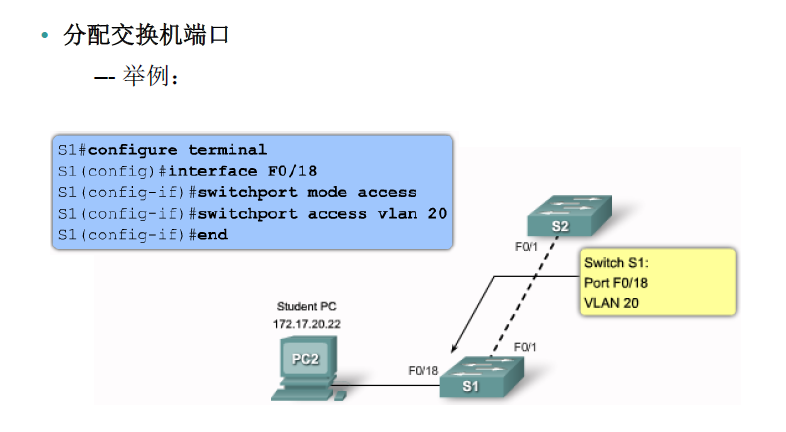

# VLAN与STP网络协议
## VLAN
虚拟局域网(virtual local area network)

### VLAN的概念
 是将局域网设备从逻辑上划分为一个个网段,从而实现虚拟工作组的数据交换技术.
- 属性
  - 分段性
  - 灵活性
  - 安全性
- 干啥用的作用是什么
  - 隔离广播
  - 方便运用
- 怎么划分
  - 端口
  - mac
- 跨地域换分VLAN
- VLAN隔离广播
- track链路(跨路由器)
- 一个VLAN中所有设备都是在同一广播域内；广播不能跨越VLAN传播。
- 一个VLAN为一个逻辑子网；由被配置为此VLAN成员的设备组成，不同VLAN通过三层路由实现相互通信。
- VLAN中成员多基于Switch端口划分，划分VLAN就是对Switch接口划分。
- VLAN工作于OSI参考模型的第二层。
- 最大VLAN支持4094
- 静态VLAN static VLAN
- 动态VLAN dynamic VLAN
- 语音VLAN voice VLAN
- 创建VLAN

## VLAN中继(Truck)
- IEEE标准(802.1Q)Truck的标准
- 封装一次802.1Q
- 本征VLAN(native VLAN)
### access
- access接口是为了打标签去标签
- 普通pc是无法发送接受带标签的数据
### truck
- 作用
  - 收发模式
    - 收
      - 1.如puid携带不等于vid(本征VLAN默认为1)
      - 2.没有puid把本征VLAN标签(vid)打上
    - 发
      - 1.如果有puid在允许的范围内,就不做任何改变
      - 2.如何不再允许方位就丢弃
      - 3.vid=puid剥离标签发出去

- 思科truck默认放行所有的VLAN
- 华为只放行本征VLAN或可信任VLAN默认1
- 不同VLAN不一定不通
- VLAN隔离的根本原因是ip网段
- 广播位的作用
  - 需要靠广播位去找相同网段,广播不能通过广播域(每个VLAN都是广播域)
  ### 冗余拓扑设计
  - STP(生成树)
  - 单点故障(防环,破环)
  - 广播风暴的形成原因
    - 因为形成环路
    - MAC地址不稳定的问题
  - 生成树STP的根桥的根桥选举原则
    - 选选出根桥
    - 再选出根端口(RP根端口)
      - 选举模式: 
      - (口诀看对端BID然后对应对端BID小的对应本端口优先,对端PID小的对应本端口优先 )
      - 对端的cost值 
      - BID=默认优先级(32768)+MAc
      - 对端的PID=端口的优先级(默认128)+对端id端口号(f0/1)
    - 选择指定端口
      - 根桥上所有端口都是指定端口
      - cost值相同比较比较本段的端口,本段端口BID小是指定端口DP
    - 选择非指定端口
    MSTP多生成树,stp和rstp的结合(多实例生成树)华为默认使用MSTP
    - MSTP---多实例生成树MSTP具有VLAN认知能力，可以**实现负载均衡**，MSTP可以定义实例，将多个VLAN映射到一个实例中，每一个实例进行单独的生成树计算。可以实现**类似RSTP**的端口状态快速切换
    pvst每VLAN生成树
    人为改变根桥的选举
    1. 改变优先级
    2. 指定根桥