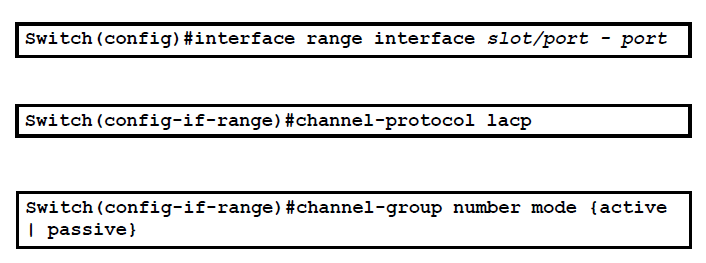
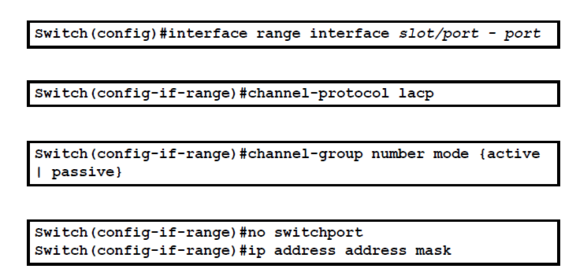
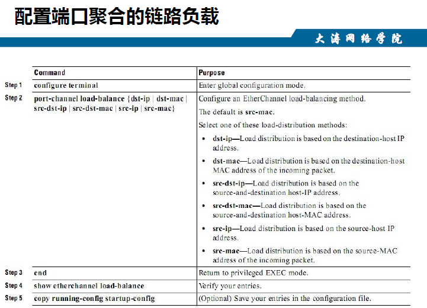
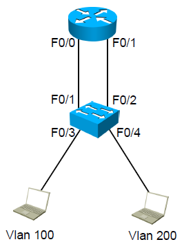
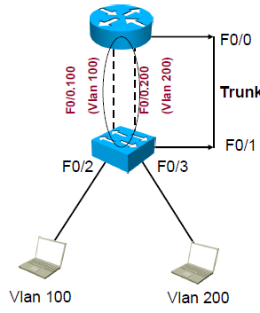

# 高级网规03课-三层路由链路聚合
## 链路聚合(端口聚合)
**作用:**
1.增加带宽
2.提高可靠性,逻辑口冗余
### LACP
- `IEEE 802.3ad`
- EtherchannelLACP Mode
1. active----主动发送LACP的协商消息
2. passive----不会主动发送LACP的协商消息，只会接受对方的协商消息

### 链路聚合的配置
- 二层链路聚合

- 三层链路聚合
- 
  所谓三层就是可以配ip
负载:可以让2个流量从其他地方走(了解)

## 实现VLAN之间路由
### 方法一：采用路由器的多个物理接口

### 方法二：采用单臂路由的方式(子接口的方式)

### 思科大二层
 vss低端交换支持vss
 vpc
 大二层
 数据中心级别的交换机(nexus2000/5000/7000/9000)vpc对应大二层的协议(不支持路由)
 
 - 低端5000/2000
 - 高端7000(性能最好)/9000
### 华为大二层css
css---(框式交换机)
istack--低端(盒式交换机)
华三IRF
vxlan的概念