# 高级网规06课-RIP路由
## RIP概述
基于**属于典型的距离向量路由选择协议**。
经过一个三层节点就是一条
目前RIP有两个版本RIPv1(应用层协议)和RIPv2()。
## RIPv1是一种应用层协议
使用**UDP** 协议的**520**端口，通过广播地址255.255.255.255(全网广播)发送和接收路由信息。
### RIP有以下一些主要特性(续)
1. RIP以到目的网络的最小跳数作为路由选择的度量标准，而不是在链路的带宽和延迟的基础上进行选择。
2. RIP是为小型网络设计的。它的最大跳数为15跳，16跳为无穷远，只能应用在中小型网络中。
3. RIPv1是一种**有类(可以分为ABC类网络)**路由协议，不支持不连续子网设计。
4. RIP周期进行路由更新，将路由表广播给邻居路由器，广播周期为**30秒**。
5. RIP的管理距离为120。
### RIP中的计时器
- 更新（Update）周期时间—30秒
- 失效（Invalid）计时器—180秒
- 清空（Flushed）计时器—240秒
- 抑制（Hold-down）计时器—180秒
### RIP的工作原理
#### RIP消息（数据包）头部格式分析
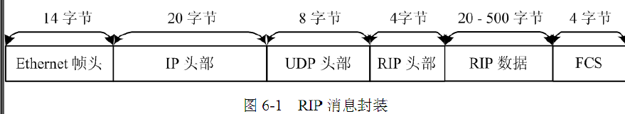
#### RIP消头部格式分析
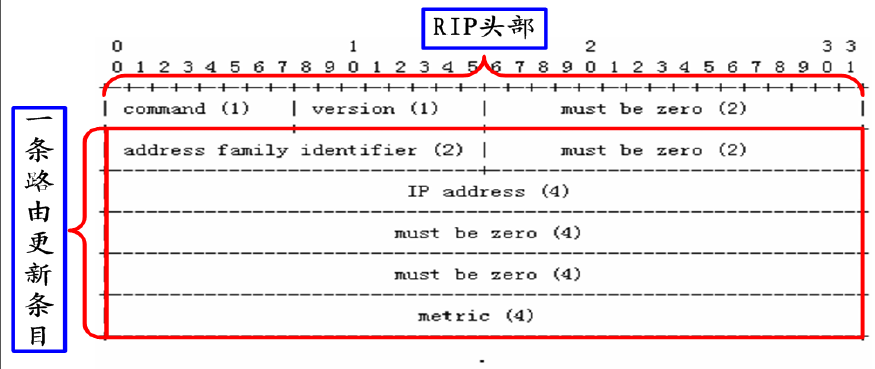
#### RIP的原理
路由表维护
 - 路由环路:
    学习路由的过程中产生的环路
    由于有了周期更新造成时间差,造成了环路
 - 解决路由自环问题
   - 计数到无穷(自带,不能解决实际问题,收敛时间太长)
   - 水平分割(从一个接口收到的消息,不从这个接口发出去)
   -  反向毒化(可以把这个接口发出去,改下一跳16)
   -  毒性逆转(当路由器学习到一条毒化路由（度量值为16）时，对这条路由忽略水平分割的规则，并通告毒化的路由。)
#### 触发更新
当网络发生变化（新网络的加入、原有网络的消失）时，路由器将立刻发送路由更新消息而**不用等待更新计时器**到时。
#### 抑制计时器(思科私有)
- 在抑制时间内，失效的路由不接受任何更新信息，除非这条信息是从原始通告这条路由的路由器来的；
- 时间一般是180s ；
- 减少了路由的浮动，增加了网络的稳定性。
#### RIP的配置
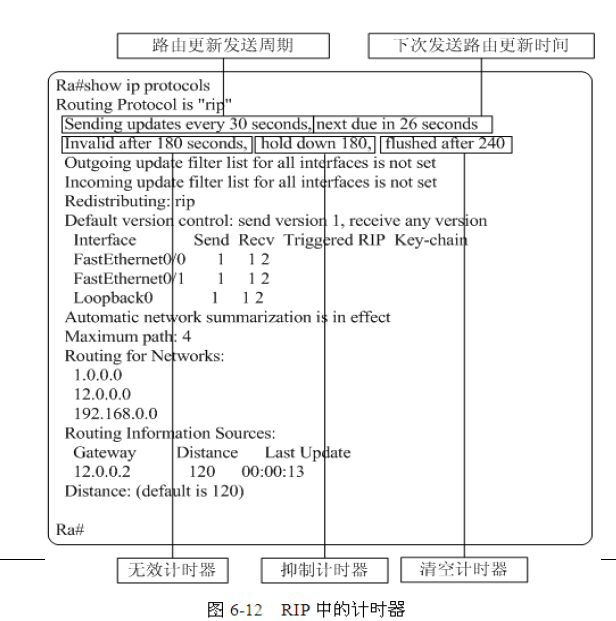
## RIPv2 
- RIPv2（RFC 1723）是RIPv1的扩展版本。
- 在RIPv2的消息包中包含了子网掩码信息。
- 在RIPv2中，更新消息发送到多播地址**224.0.0.9**。
- RIPv2可以关闭**自动总结**的特性。
### RIPv2消头部格式分析
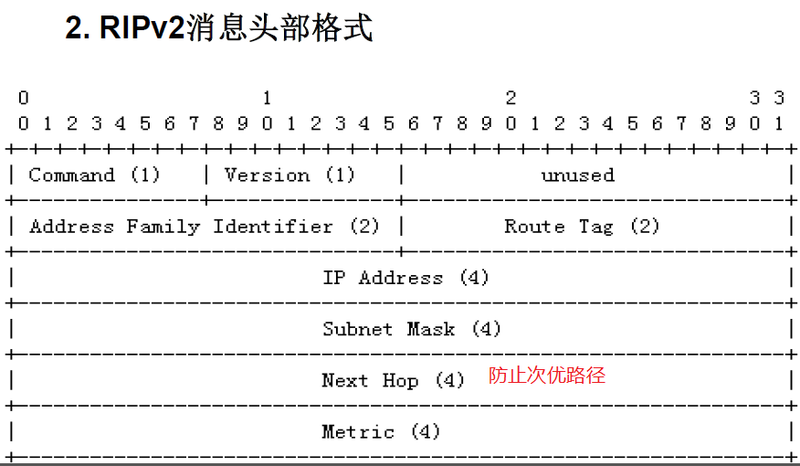
### RIPv2配置
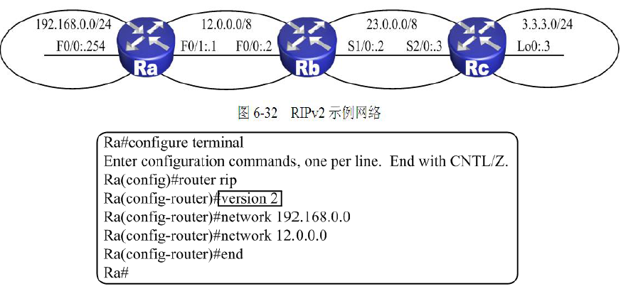
配置网络号写主类网络号
### RIPv2自动汇总与手工汇总
#### 自动汇总 
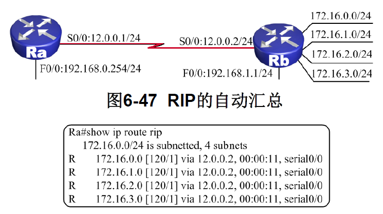
默认开启自动汇总
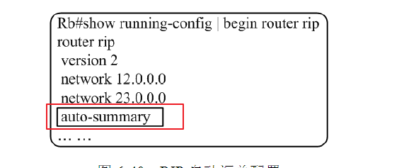
`auto-summary`
#### 手动汇总
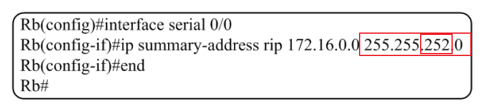
谁发在哪个接口上汇总
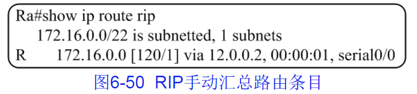
### 配置单播更新和被动接口
- RIP被动接口：RIP路由器的某个端口仅仅学习
1. 被动是只可以收,不可以发(只收不发)
2. **意义:**
   1. 一般用在网络的边缘
   2. 内部私有网段不想给外界知道
配置
```思科
–Router(config-router)#passive-interface {default |interface-type interface-num}
```
- RIP 报文单播更新

RIP 路由信息需要通过非广播网络传输，或需要限制一个接口通告广播式的路由更新报文
指定和谁更新 `neighbor +ip地址`
```思科
–Router(config-router)# neighbor ip-address
```
### 负载分担
流量负载分担,基于跳数作为度量值。
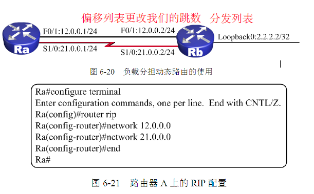
### RIP缺省路由
下发默认路由 
`0.0.0.0 0.0.0.0 A端口地址`
- 什么情况下关闭水平分割?
为了防止环路
帧中继情况需要关闭 
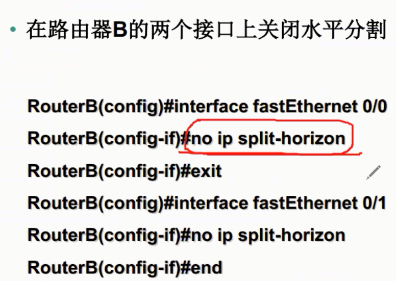
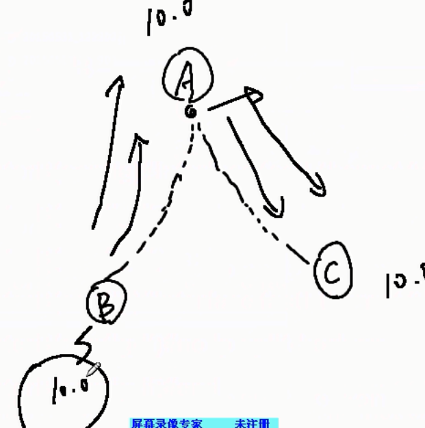