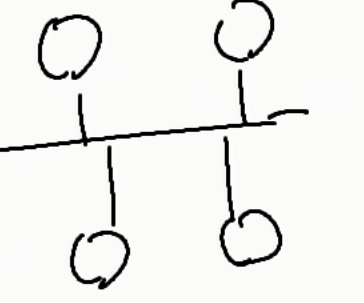
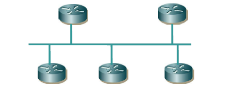
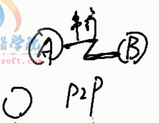
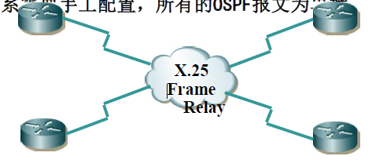
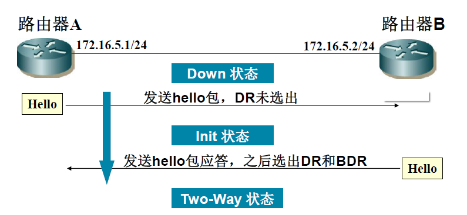
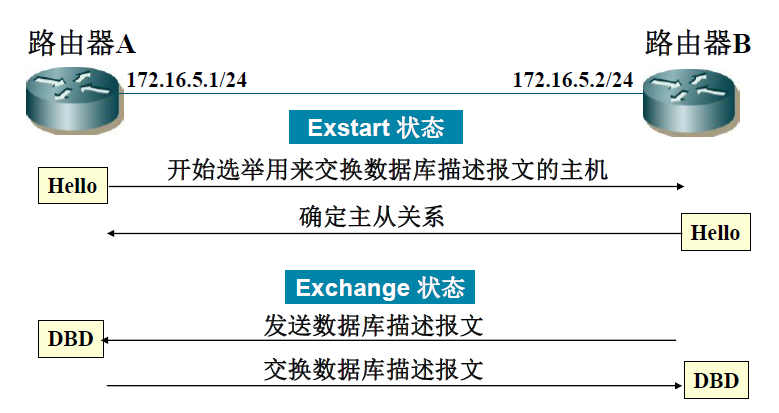
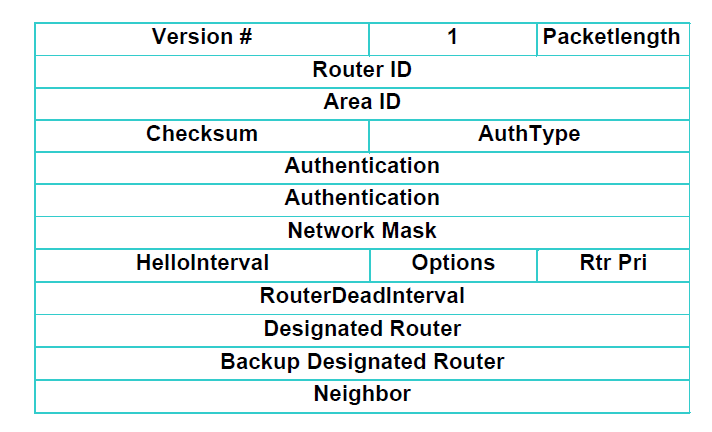
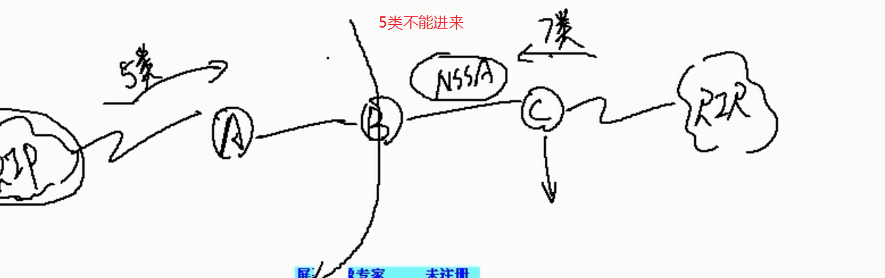
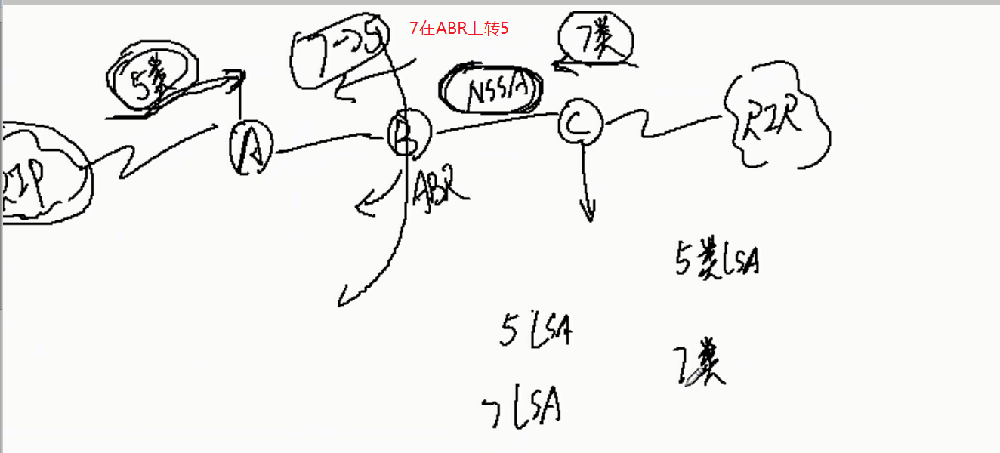
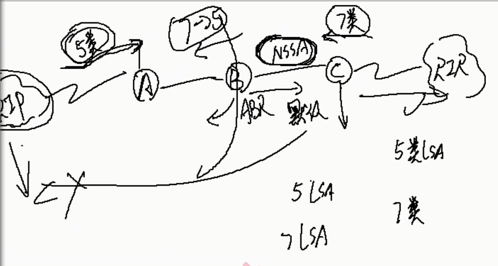

# 高级网规08课-OSPF路由
## OSPF协议特性
- OSPF Open Shortest Path First(开放式最短路径优先)
- 内部网关路由协议
- 链路状态路由协议
- 基于SPF算法
- 支持可变长子网掩码VLSM
- 具有更快的收敛速度(RIP是周期性更新,OSPF是触发式更新)
### 内部网关路由协议
- OSPF是一种典型的**内部网关路由协议**（Interior Gateway Protocol，IGP），一般用于**同一个路由域内**，在这里，路由域是指**一个自治系统**（Autonomous System，**AS**）内决策路由。
- `自治系统`是指一组通过**统一的路由政策**或**路由协议互相交换**路由信息的网络。
## 链路状态路由协议
- OSPF是一种链路状态路由协议。
  - 这意味着路由选择的变化基于网络中路由器物理连接的状态与速度，并且变化被**立即**广播到网络中的**每一个路由器**。
- `链路状态`指的是一个路由器的**局部信息状态**、路由器相连的**网络状态信息**、**外部状态信息**等。
- 所有的OSPF路由器都维护一个**相同**的描述链路状态的数据库(LSDB )。
- OSPF将**LSA（LinkState Advertisement)，**链路状态广播数据包）传送给在**某一区域内**的所有路由器。
## SPF基本概念—路由器标识
- `SPF`路由器标识(必须的)：
- 如果OSPF网络无法建立邻居有可能是**路由器标识**相同了
- 该路由器上最高的**本地环回接口**(LOOPBACK地址)
- 若无回环地址，则优先使用**最高位IP地址**
## OSPF基本概念—DR和BDR
- OSPF建立连接是hello报文
- DR：在一个广播性的、多接入的网络中，存在一个**指定路由器**（Designated Router）。
- DR的作用：
与所有其他邻居同步(节省网络开销)产生network **LSA用以描述网络链路状态**
- BDR的作用：
做为DR的**备份**，在DR失效时接管它。
- DR和BDR的选举
  1. 优先级默认为**1**
  2. 优先级相同的选择rootID的选举到ip的选举,根端口选举 基于网段的选举
- 多路访问网络中DR（指定路由器）的设计思想是使**邻接的数目减少**
- 多路访问网络中路由器只与**DR和BDR建立邻接**。
- **优先级最高**的路由器做为DR。
- 一旦DR选出，其他路由器**无法替代**，除非这个DR失效

## OSPF网络类型
### OSPF有5种网络类型或模型
1. 广播型
2. 点到点
3. NBMA网络(非广播多路访问)
4. 点到多点网络(属于NBMA网络)模型上不太一样 
5. 点到多点非广播(P2MP)
### 广播型
  
  `广播型网络`：是一种具有**多个访问设备**的网络，同时可连多于两个设备，例如以太网
  1. 需要进行DR/BDR 的选举
  2. 所有的非DR/BDR路由器和DR/BDR 形成完全邻接关系
  3. DROTHER 通过DR/BDR 交换信息
   
### 点到点
  
  `点到点网络`：如E1线路，是连接单独一对路由器的网络。这种网络上的邻居间总是可以形成邻接。
  1. 适用于部分互连或星形拓扑结构里
  2. 不需DR,只使用单独的一个子网
  3. 自动发现邻居
  4. LSU 包被发送到每个邻居路由器的接口
  
### NBMA网络(非广播多路访问)
  1. `NBMA(Non-Broadcast Multi-Access)网络`：可以连多个设备的网络，但是没有广播能力，例如frame relay，x.25，ATM
  2. 一个设备发出的报文**不会被所有的设备收到**
  3. 所以，OSPF路由器要选择**DR和BDR**
  4. **邻居关系**需要手工配置，所有的OSPF报文为单播
  
   
  

### 点到多点网络(属于NBMA网络)模型上不太一样
### 点到多点非广播(P2MP)
  - 多个点到点网络(不需要选举DR)
  - 不选举DR和BDR

## OSPF基本概念
- OSPF传递路由条目都是由LSA携带的
- OSPF可以划分区域
## OSPF协议工作流程
- 与邻居形成完全邻接关系
1. 发现邻居
2. 双向通信
3. 数据库同步
- 将链路状态**数据库更新**扩散给其他路由器
- 路由器计算**最短路径树**，生成路由表。
## 邻接如何形成
 

OSPF协议号为 **89**
## OSPF报文类型

### hello报文

**建立OSPF的必要前提**
1. ID不能相同
2. 接口区域要相同area要相同
3. 验证要通过(认证要相同)
4. hello时间相同(每种网络类型有不同的网络实践)
   1. 点到点hello时间是10s, 超时40s
   2. 广播hello时间是10s, 超时40s
   3. NBMAhello时间是30s, 超时120s
   4. P2MPhello时间是30s, 超时120s
5. 特殊区域认识相同

## 路由器按工作分类
ABR区域间路由器
不同网络时间通讯需要重新发布
ASBR自治区域 路由器
## 链路状态通告（LSA）分类
- 类型1:router LSA(路由器链路状态宣告)
  - Link ID:接口连接的链路
  - 只在两个路由之间传播
- 类型2:network LSA(网络链路状态宣告)
  - DR和BDR产生的
  - 描述的DR和BDR的链路状态
  - 只能在所属的区域内传播(不能穿越ABR区域间路由器)
- 类型3/4:summary LSA(网络/路由器汇总链路状态宣告)
  - 3类的LSA聚合的LSA
  - 谁产生的:ABR
  - 汇聚路由是在路由发路由
  - OSPF路由汇聚只是在ABR上汇聚,汇聚的是OSPF域内的路由
  - 描述的信息:所连接的某个区域内网段的聚合路由,或说是目的路由(目的网段的路由信息)
  - 类型4
    - 如果路由目的为一个ASBR，则生成Type4 LSA。它的链路状态ID为目的ASBR的RID。
      - 5类产生的RID不变化
      - 7类的RID变化
      - 4类主要记录RID的变化和承载类
- 类型5:AS external LSA(自治系统外部链路状态宣告)
  - ASBR自治域间的路由器(5类的LSA)
  - 普通区域连接了其他区域他们产生是5类LSA
- 类型7:NSSA连接了其他区域,他们产生我7类LSA
## OSPF的区域划分
- stub(末节区域)
  - 1：只有一个连接其他区域的ABR，没有ASBR，且不能有虚连接(就像一个死胡同)
  - 2：ABR向本区域内部发布一条指向自己的默认路由
  - 3：4，5类LSA不能进来
  - 属于边缘网络
- totally stub（完全末节区域）
  - 1：只有一个连接其他区域的ABR，没有ASBR，且不能有虚连接
  - 2：ABR向本区域内部发布一条指向自己的默认路由
  - 3：3，4，5类LSA都不能进来
- NSSA（非纯末节区域）Not-So-Stubby Area
  - 1：可以位于非边缘区域
  - 2：ASBR作为AS的边界，可以引入AS以外的路由
  - 3：由ABR下发默认路由(为了和其他区域通讯)
  - 4：ASBR可从直连的外部AS引入**7类LSA**,并在ABR上7类转5类，**不允许与其他区域中ASBR连接的外部AS相关的4，5类LSA进入本区域**
  
  
  
- totally NSSA （非纯完全末节区域）
  - 1：可以位于非边缘区域
  - 2：ASBR作为AS的边界，可以引入AS以外的路由
  - 3：由ABR下发默认路由
  - 4：ASBR可从直连的外部AS引入7类LSA,并在ABR上7类转5类，不允许与其他区域中ASBR连接的外部AS相关的4，5类LSA进入本区域，且不允许3类LSA进入
- 区域划分(两类没有根本联系)
  - 骨干区域/非骨干区域(OSPF)
  - 普通区域/ 末节区域
  - 配置了Area1是主干区域Area0非主干,配置了Stub是末节去域
  - 7类产生配置了NSSAstub就会产生7类LSA
