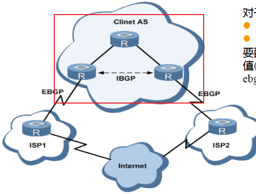
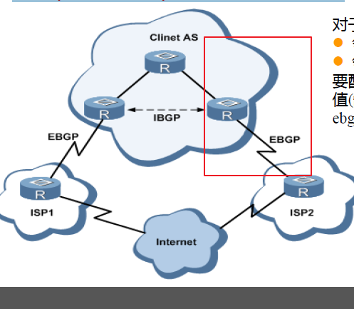
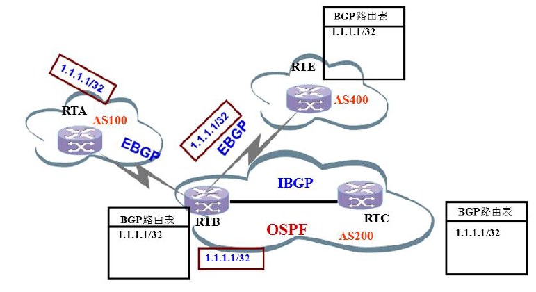
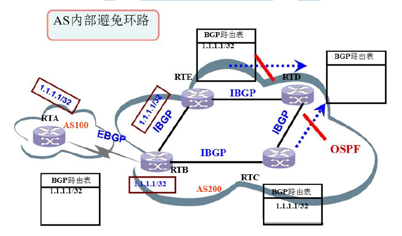
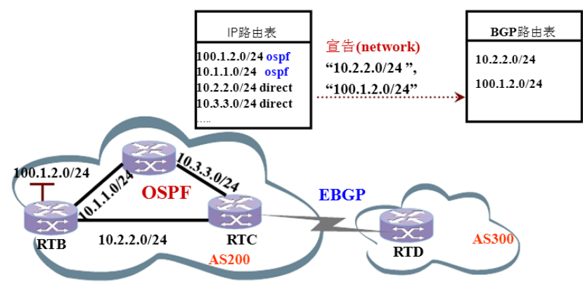
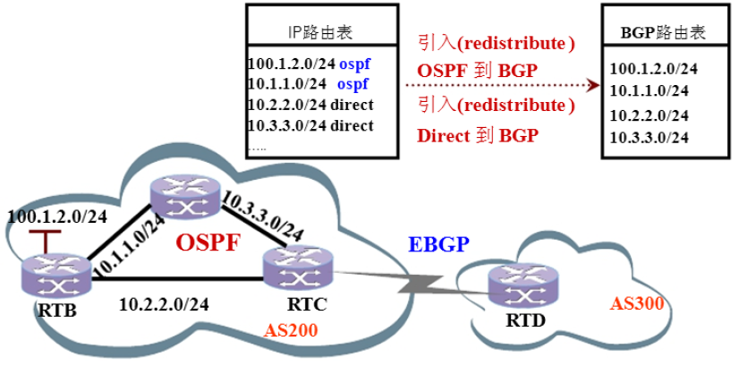
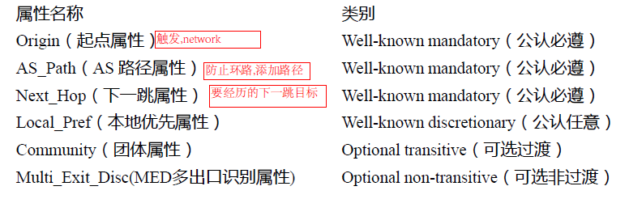

# 高级网规10课-BGP路由
## 路由分类
1. 机器人式的路由(你告诉他就告诉你怎么办)
2. 动态路由(你给算法他就算出来)
3. 以物理形式和空间形式
## BGP路由
### 自治系统(AS)
### IGP(Interior gateway protocols)——内部网关协议
在一个自治系统内部使用的路由协议(包括动态路由协议和静态路由)。IGP 的功能是完成数据包在AS 内部的路由选择。RIP、OSPF(几万条路由协议)、IS-IS 都是典型的IGP。

### EGP(Exterior gateway protocols)——外部网关协议
在多个自治系统之间使用的路由协议。它主要完成数据包在AS 间的路由选择。BGP-4 就是一种EGP。IGP **只作用于**本地AS 内部，而对其他AS 一无所知。它负责将数据包发到主机所在的网段(segment)。EGP 作用于各AS 之间，它只了解AS 的整体结构，而丌了解各个AS 内部的拓扑结构。它只负责将数据包发到相应的AS 中，其他工作便交给IGP 来做。
### BGP应用场景(大量路由表需要传递的)
ISP（Internet Server Provider 网络技术服务商）如何统一管理自己的网络，并实现ISP之间交互路由，以访问整个Internet？
NAT（Network Address Translation，网络地址转换）
### BGP协议具有如下特点：
- BGP是一种外部网关协议（EGP），不OSPF、RIP等内部网关协议（IGP）丌同，其着眼点丌在于发现和计算路由，而在于控制路由的传播和选择最佳路由。  
- BGP使用TCP作为其传输层协议（监听端口号为179），提高了协议的可靠性。
- BGP支持无类别域间路由CIDR（Classless Inter-Domain Routing）。
- 路由更新时，BGP只发送更新的路由，大大减少了BGP传播路由所占用的带宽，适用于在Internet上传播大量的路由信息。
- BGP是一种距离矢量路由协议，从设计上**避免了环路的发生**。
  - AS之间：BGP通过携带AS路径信息标记途经的AS，带有本地AS号的路由将被丢弃，从而避免了域间产生环路。
  - AS内部：BGP在AS内学到的路由丌会在AS中转发，**避免了AS内产生环路**。
- BGP提供了丰富的路由策略，能够对路由实现灵活的过滤和选择。
- BGP提供了防止~~路由振荡~~ -的机制，有效提高了Internet网络的稳定性。
- BGP易于扩展，能够适应网络新的发展。
### BGP运行方式
- **对等体(peers or neighbors)**：建立了BGP会话连接的路由器。
- **IBGP(Internal BGP)**：指单个AS内部的路由器之间的BGP连接

- **EBGP(External BGP)**：指AS之间的BGP连接。
- 要传递BGP路由OSPF接收不下这么大的路由条目,所以需要建立IBGP对等路由条目,来接收BGP路由
- 
### BGP消息类型——5种消息
BGP 使用五种类型的消息:
Speaker：发送BGP消息的路由器称为BGP发言者(一般是AS发言者)（Speaker），它接收或产生新的路由信息，并发布（Advertise）给其它BGP Speaker。当BGP Speaker收到来自其它自治系统的新路由时，如果该路由比当前已知路由更优、或者当前还没有该路由，它就把这条路由发布给自治系统内所有其它BGP Speaker。
Peer：相互交换消息的BGP Speaker之间互称对等体（Peer），若干相关的对等体可以构成对等体组（Peer Group）。
- Open——建立BGP 连接
- Keepalive——检测和维护BGP连接
- Update——发送BGP 路由更新
- Notification——中断BGP连接
- Route-Refresh——通知对等体自己支持路由刷新能力
### BGP报文处理过程
1. 首先建立TCP 连接。
2. BGP Speaker通过Open 消息协商参数，建立BGP 邻居关系。
3. 建立连接后，BGP邻居会通过Update 消息及时增量更新路由表。
4. BGP 会发送Keepalive 消息来维持邻居间的BGP 连接。
5. 当BGP 检测到网络中的错误状态时，BGP 发Notification 消息报错，BGP连接中断。
### BGP连接状态(了解)
- 发送TCP进入链接,链接成功进入active成功发送open不成功发送notification进入active在发送open,没问题进入链接
1. 空闲（Idle）：这是BGP刚启动后的第一个状态(TCP)
2. 连接（Connect）：BGP在等待TCP连接成功时状态
3. 激活（Active）：BGP重新启动TCP连接时的状态
4. OPEN发送（Open sent）：TCP连接成功后，BGP开始发送OPEN消息,并等待对方的OPEN消息时的状态
5. OPEN证实（Open confirm）：接收到邻居OPEN消息后，BGP等待Keepalive消息或者Notification消息时的状态
6. 已建立（Established）：这是相邻体协商的最后阶段或者稳定阶段，BGP开始不对端交换Update数据包
### BGP路由通告原则
BGP发布路由时采用如下策略：
- 存在多条有效路由时，BGP Speaker只将最优路由发布给对等体。
- BGP Speaker从EBGP获得的路由会向它所有BGP对等体发布（包括EBGP对等体和IBGP对等体）。
- BGP ~~Speaker~~从IBGP获得的路由不向它的IBGP对等体发布。
- BGP Speaker从IBGP获得的路由发布给它的EBGP对等体。
- 连接一旦建立，BGP Speaker将把自己所有BGP路由发布给新对等体。
#### BGP路由反射器
- 收到路由不在发射出去
- 多互联+(RR路由反射器)传过来的路由条目
### BGP路由通告原则
#### EBGP之间
BGP Speaker从EBGP获得的路由会向它所有BGP对等体通告（包括EBGP和IBGP）。
 
#### IBGP之间
BGP ~~Speaker~~从IBGP获得的路由不会通告给它的IBGP邻居(为了AS内部防止环路)

### 如何形成BGP路由
#### network方式
BGP 的路由信息需要通过配置命令的方式注入到BGP中
下图为把IP路由表内的某条路由通告到BGP路由表中，使用network命令

#### 路由重发布
通过引入IGP路由、静态路由或直连路由到BGP路由表，使用redistribute命令

#### EBGP
### BGP属性的分类
BGP路由属性是一套参数，它对特定的路由进一步的描述，使得BGP能够对路由进行过滤和选择。所有的BGP路由属性都可以分为以下4类：
1. 公认必须遵循的（Well-known mandatory）：所有BGP路由器都可以识别，且必须存在于Update消息中。如果缺少这种属性，路由信息就会出错。
2. 公认任意（Well-known discretionary）：所有BGP路由器都可以识别，但不要求必须存在于Update消息中，可以根据具体情况来选择。
3. 可选过渡（Optional transitive）：在AS之间具有可传递性的属性。BGP路由器可以不支持此属性，但它仍然会接收带有此属性的路由，并通告给其他对等体。
4. 可选非过渡（Optional non-transitive）：如果BGP路由器不支持此属性，则相应的Update消息会被忽略，且不会通告给其他对等体。

- `ORiginetor ID` 反射器标识_作用防环(经过一个RR就加一个ID)--可选非过渡(和AS-path相似)(前面的反射器和后面的反射器比较)
- `claster list` 也是存在反射器(RR)时候的运用,作用也是防环 (反射器和我自己的ID进行比较)__可选非过渡
### BGP选择路由的策略
1. 路由器优选weight值(权重值)最大的条目，范围0-65535，；
2. 优选本地优先级（Local_Pref）最高的路由，默认值为100 ；
3. 优选聚合路由（聚合路由优先级高于非聚合路由）；
4. 优选AS路径（AS_Path）最短的路由；
5. 比较Origin属性，依次选择Origin(起源路径)类型为IGP(一般network)>、EGP> 、Incomplete(重发)的路由；
6. 优选MED值最低的路由；
7. 优选从EBGP学来的路由（EBGP路由优先级高于IBGP路由）；
8. 优选AS内部IGP的Metric最低的路由；
9. 优选建立时间最长的EBGP对等体传递的条目；
10. 优选Router ID最小的路由器发布的路由；
11. 优选cluster-list短路径(意味着经过的路由反射器少)；