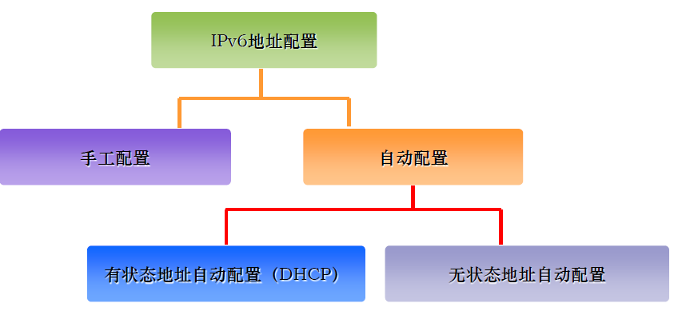

# 高级网规13课-IPV6协议
## 为什么要引用IPv6
- IPv4取得了极大的成功
- IPv4地址资源的紧张限制了Internet的进一步发展
- NAT(**网络地址转换**)、CIDR(**无类域间路由**)、VLSM(**可变长了网掩码**)等技术的使用仅仅暂时缓解IPv4地址紧张，但不是根本解决办法。
- 新技术的出现对IP协议提出了更多的需求
- 智能就是可以实现远程控制
- 地址空间的优势-给每个设备都分配一个全球唯一的IP地址
## Pv6地址技术
### IPv6地址表示
- IPv6地址= 前缀+ 接口标识
- 前缀：相当于IPv4地址中的网络ID
- 接口标识：相当于IPv4地址中的主机ID
- 前缀长度用“/xx”来表示
- 2001：da8：207：：8207/64
### IPv6地址分类
#### IPv4地址分类
- A类，B类，C类，D类，E类
- 单播地址：A、B、C类地址
- 多播地址：D类
- 保留地址：E类
- 广播地址：255.255.255.255等  
#### IPv6地址分类
- 单播地址（Unicast Address）
标识一个接口，目的地址为单播地址的报文会被送到被标识的接口
- 组播地址（Multicast Address）
标识多个接口，目的地址为组播地址的报文会被送到被标识的所有接口
- 任播地址（Anycast Address）
标识多个接口，目的为任播地址的报文会被送到最近的一个被标识接口，最近节点是由路由协议来定义的
- 特殊地址

#### IPv6单播地址
- 可聚合全球单播地址(相当4的可路由的共有IP)
- 链路本地地址()
- 站点本地地址(相当4的私有IP)
- 其它地址
##### 可聚合全球单播地址
使用类似CIDR的分级体系，有利于路由聚合

前三位必须是001

- 可聚合全球单播地址的前缀前3位固定是001 有效地址范围前缀（2000~3FFF）
- 前缀前3位固定是001有效地址范围前缀（2000~3FFF）
- 目前只使用了下面两个前缀地址段，其它的为保留地址段

`2001::/64` 首批使用的可聚合全球单播地址
`2002::/64` IPV4网络中建立6to4隧道地址
IPv4网络中建立6to4隧道的地址_过渡地址
#### 无状态地址自动配置—接口ID生成
- IEEEEUI－64规范是其中最重要的一种生成方法
- 将48比特的MAC地址转化为**64比特的接口ID**
  - MAC地址的唯一性保证了接口ID的唯一性
  - 设备自动生成，不需人为干预
- 无状态地址自动配置—接口ID生成
- 加入的第7位取反
- MAC`0`代表永久的MAC
- MAC`1`代表临时的MAC 
  
#### 站点本地地址(私有地址)
应用范围局限在一个站点内使用，类似于IPv4中的私有地址

#### IPv6组播地址

**特殊的组播地址**
FF01::1(节点本地范围所有节点组播地址)
FF02::1(链路本地范围所有节点组播地址)
FF01::2(节点本地范围所有路由器组播地址)
FF02::2(链路本地范围所有路由器组播地址)
FF05::2(站点本地范围所有路由器组播地址) FF02::1:FFXX:XXXX(Solicited-Node组播地址)
**前缀FF02:0:0:0:0:1:FF这104位是固定的**，后面的XX:XXXX这24位是接**口ID的后24位**，即48位网卡MAC 地址的后24位。

## IPv6地址配置
1. 手动配置
2. 自动配置
   1. 有状态地址自动配置（DHCP）
   2. 无状态地址自动配置
   

### IPv6手工地址配置—主机
- 主机地址手动配置
- 进入网卡配置模式
C:\Documnts and Settings \Administrator>netsh
- 进入IPv6配置模式
netsh>inerface ipv6
- 配置IPv6地址netsh interface ipv6>add address “本地连接”2::2
- 生成的64位就叫接口ID

### 重复地址检测（DAD）过程

- 获得临时地址的主机发送NS报文（Neighbor Solicitation），目标IP是该临时地址所对应的solicited-node组播地址。
- 如果收到NA报文（Neighbor Advertisement）响应，则该临时地址不可用
- 如果无人响应，则认为没有地址冲突发生，该地址正式可用

### 无状态自动配置—前缀获得
具有一部分相同路由重复的标识
1. 主机发送Router Solicitation(RS)报文
2. 路由器回应Router Advertisement(RA)报文
3. 主机获得前缀及其它参数
4. 路由器周期性地向外发送RA报文

### 配置ipv6
 