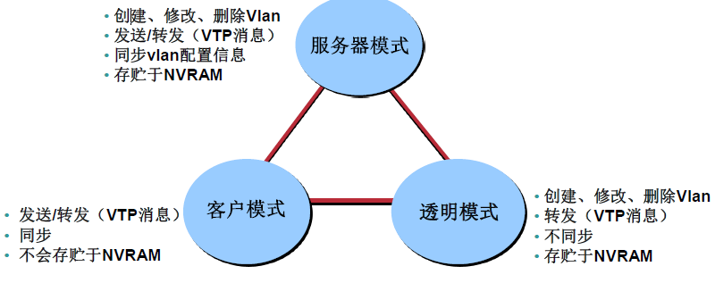

# 高级网规15课-VTP、ACL

## VTP协议（VLAN Trunking Protocol）

- VTP负责在交换机之间同步**Vlan信息** (不能同步端口)，如Vlan的添加、删除、修改
- VTP是一个能够宣告VLAN配置信息的信息系统(可以把自己身上VLAN告知其他)
- VTP通过一个共有的管理域，维持VLAN配置信息的一致性
- VTP只能在**Trunk链路**上发送要宣告的信息


### 查看VTP信息

可以通过`show vtp status`(**stats是名字随便取**)来查看VTP信息，
下面是一台思科交换机的VTP信息的显示：


### VTP的域名

有了VTP，就可以在一台交换机上集中进行配置了，所做的配置会被自动传播到网络中的所有其他交换机上，但是前提是：所有的交换机必须工作在同一个VTP域中，交换机的域名默认为空，空域名的交换机会学习有域名的交换机域名，另外，不同域中的交换机不能交换VTP信息。

通过下面的命令修改VTP的域名：
`SW1（config）#vtp domain cisco`
- 注意：当更改VTP域名时，**VTP配置版本号会被自动清零**。

### VTP的模式



- 服务器模式
  - 创建、修改、删除Vlan
  - 发送/转发（VTP消息）
  - 存贮于NVRAM
- 客户模式
  - 发送/转发（VTP消息）
  - 不会存贮于NVRAM
- 透明模式(比较靠近接入层)
  - 创建、修改、删除Vlan
  - 转发（VTP消息）
  - 不同步
  - 存贮于NVRAM
  
### VTP的工作方式

- VTP信息宣告以多点传送的方式来进行（从所有的Trunk接口发出去）
- VTP服务器和客户端模式下会同步最新版本的宣告信息（**配置版本号最大**）`VTP的修订号最大`
- VTP信息宣告每隔5分钟或者有变化时发生


### VTP的配置

1. 定义VTP域名,在同一VLAN管理域交换机的VTP域名必须相同，域名为空的交换机会学习有域名的交换机的域名：
`Switch(config)#vtp domain {domain-name}`
2. 定义VTP模式(配置这几种模式)：
`Switch(config)#vtp mode {server|client|transparent}`
3. 设置VTP域的密码,同一VTP管理域的VTP密码必须一致(建议)：
`Switch(config)#vtp password {password}`

## ACL的作用


`防火墙就是基于ACL的功能实现的`
- 访问控制列表是一系列的规则，用于对经过路由器的**数据包进行过滤**，决定是否转发或者**阻止数据包**；
- 限制网络流量，提高网络性能：路由器不需要处理的流量，ACL可以进行过滤；
- 为网络的访问提供基本的安全：ACL可以允许某个主机访问网络的某个部分，而阻止另一台主机访问网络的这个部分；
- 决定转发或阻止哪些类型的数据流：可以允许转发E-Mail流量，而阻止即时通讯流量；


### ACL的基本应用

- 允许（permit）、拒绝（deny）数据包通过路由器端口
- 允许、拒绝虚拟会话的建立

### ACL的高级应用


### ACL的类型-标准ACL


- 标准ACL
  - 只检查数据包的源地址
  - 通常允许、拒绝的是**完整的三层协议，如IP协议**

### ACL的类型-扩展ACL


- 扩展ACL
  - 检查数据包的**源和目的**
  - 通常允许、拒绝的是某个特定的协议，**如IP、OSPF、TCP等**

### ACL配置指南(★)

- ACL的内容输入顺序决定了数据的控制顺序（从上往下执行）`一般是从上到下,但是也不一定`
- **ACL匹配**了任何一条语句，**都不会往下执行**了
- 具有严格限制条件的语句应放在ACL所有语句的最上面`越是精确匹配的越往上放`
- 在ACL的最后有一条隐含声明：`deny any`拖底（拒绝所有），数据包与所有行都不匹配的话，最终会被丢弃；每一条正确的**ACL都至少应该有一条允许语句**
- 先创建ACL，然后应用到**接口或者虚拟会话上**，先定义后应用`入和出的概念:数据包传递入方向in出方向是out`
 `数据包方向和路由传递方向是反方向`
- **ACL不能过滤由路由器自己产生的流量** 

- **标准ACL尽量靠目的地配置**
- **扩展ACL尽量靠源配置**

### 通配符掩码

ACL的配置中都会包含通配符掩码，比如192.168.1.0 0.0.0.255中的0.0.0.255即为通配符掩码，IP地址和通配符掩码一起用来确定IP地址的范围，通配符掩码中0表示匹配，1表示不匹配，该实例中就相当于匹配了前24位，也就是说前24位必须匹配，后8位是什么无所谓，这样就相当于匹配了192.168.1.0/24这个网络，也就是匹配这个网络中的254个IP地址。
`子网掩码的反码`

### 两个常用的特殊通配符掩码

- 可以用any来代表`0.0.0.0`  `255.255.255.255`这样的通配符掩码，表示任何、所有主机
- 可以用host来代表`0.0.0.0`这样的通配符掩码，表示单一的主机，比如，`192.168.1.1`  `0.0.0.0`可以用host 192.168.1.1代替

### 配置标准的ACL

Router(config)#
`access-list access-list-number {permit|deny} source`
- IP 标准访问列表编号范围：1-99和1300-1999
- 默认的通配符掩码：0.0.0.0
- Log是可选选项
- `no access-list access-list-number` 命令可以删除整个标准ACL，ACL中所有的语句都会被删除

### 在端口上应用ACL

Router(config-if)#
`ip access-group access-list-number { in | out }
- 在端口上应用ACL
- 指明是进方向还是出方向调用ACL
- `no ip access-group access-list-number in|out ` 命令可以在端口上删除访问列表应用

### 标准访问列表举例


### 配置扩展的ACL

Router(config)#
`access-list access-list-number{ permit | deny } protocol source source-wildcard destination destination-wildcard[established] [log]`

- 扩展ACL列表号的范围是：100-199和2000-2699
- 一般用eq来匹配上层应用
- established表示匹配已建立的连接，用来做TCP的单向访问控制
`Router(config-if)# ip access-group access-list-number { in | out }`
在端口上应用ACL
`Router#show access-lists 或者show ip access-lists`
```csiso
Router#show access-lists 或者show ip access-lists
Standard IP access list 1
permit 10.2.2.1
permit 10.3.3.1
permit 10.4.4.1
permit 10.5.5.1
Extended IP access list 100
permit tcp host 10.22.22.1 any eq telnet
permit tcp host 10.33.33.1 any eq ftp
permit tcp host 10.44.44.1 any eq www
```

- 拒绝子网172.16.4.0内的主机使用路由器的E0端口向外建立Telnet会话
- 允许其它流量

### 命名的ACL-扩展

命名的ACL是把标准、扩展ACL的列表号用字符串来表示，可以方便记忆，而且可以对标准、扩展ACL就行编辑，如添加，删除特定的语句，标准、扩展ACL无法做到的。
`可选择一个规则号`
`命名的规则可控`
```cisco
Standard IP access list 1
    10 permit 192.168.10.0, wildcard bits 0.0.0.25520 permit any
    通过命名的ACL给标准的ACL添加一个语句：
Standard IP access list 1
    5 deny 192.168.1.1
    10 permit 192.168.10.0, wildcard bits 0.0.0.255
    20 permit any
```