# 高级网规16课-NAT、DHCP

## NAT技术

### NAT技术背景

- 随着Internet的飞速发展，网上丰富的资源产生着巨大的吸引力
- 但这受到IP地址的许多限制
- 首先，许多局域网在未联入Internet之前，局域网上有许多现成的资源和应用程序，但它的IP地址分配不符合Internet的国际标准，因而需要重新分配局域网的IP地址，这无疑是劳神费时的工作
- 其二，随着Internet的膨胀式发展，其可用的公网IP地址越来越少，要想在ISP处申请一个新的IP地址已不是很容易的事了
- **公网IP地址短缺**已经成为一个十分突出的问题，NAT是解决这种问题行之有效的方法

### 私有地址和公有地址

私有地址只能在私有网络，比如企业的内部局域网中路由和转发，而不能在公有网络，比如Internet中路由和转发，RFC1918定义了三个私有地址段，这些地址可以被用到任意私有网中：
10.0.0.0-10.255.255.255
172.16.0.0-172.31.255.255
192.168.0.0-192.168.255.255
公有地址即为在Internet上全球唯一的地址，公有地址可以在公网上路由和转发

### NAT实现方法

- NAT解决问题的办法是：在内部网络中使用私有地址，通过**NAT把内部地址翻译成合法的IP地址**，在Internet上使用
- 具体的做法是把IP包中私有地址用合法的公有地址来替换

### NAT的术语

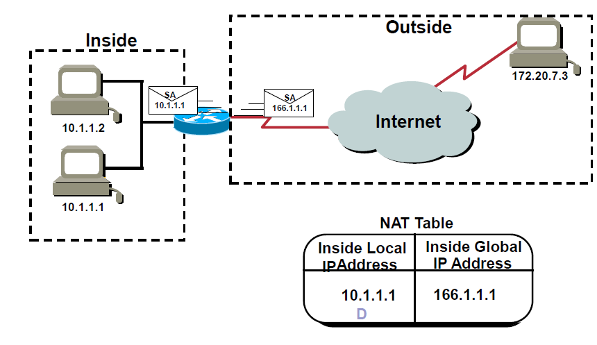
`inside local` 内部本地地址
`inside global` 内部全局地址
`outside local` 外部本地地址
`outside global` 外部全局地址
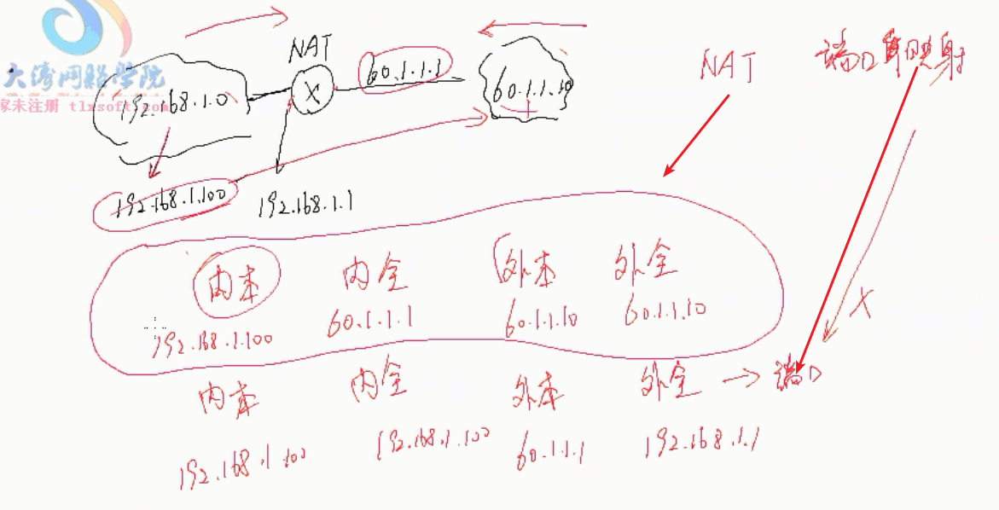

### NAT的功能

NAT 功能:
- 内部网络地址转换
- 复用内部全局地址
- 解决网络地址重叠
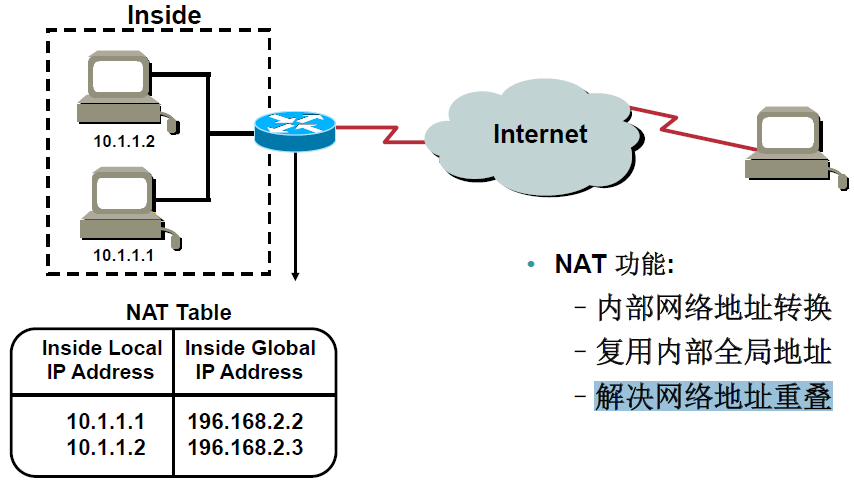

### 复用内部全局地址

- 将一个内部全局地址用于同时代表多个内部本地地址
- 主要用IP地址和端口号的组合来唯一区分各个内部主机
- 复用技术目前在生活中普遍应用
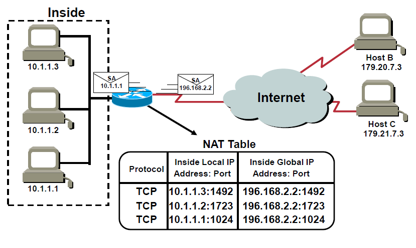

### NAT三种类型

- NAT有三种类型：**静态转换**`1对1的模型`、**动态转换**`指多个内部地址对多个外部地址`、**端口转换（PAT）**`多对一或多对少后面都要加端口` `大部分都是基于端口转换`。
- 静态转换设置起来最为简单，内部网络中的每个主机都被永久映射成外部网络中的某个合法的地址,多用于服务器。一对一的转换。
- 动态转换是在外部网络中定义了一系列的合法地址，叫做**地址池**，采用动态分配的方法映射到内部网络，多对多的转换。
- PAT则是把内部地址映射到外部网络的一个IP地址的**不同端口上**。多对一的转换。

### 静态NAT配置

```Cisco
interface fa0/0
ip address 192.168.1.254 255.255.255.0
ip nat inside（指定内部接口）
!
interface Gi0/0
ip address 191.1.1.1 255.255.255.0
ip nat outside （指定外部接口）
!
ip nat inside source static 192.168.1.1 191.1.1.1
(建立两个IP地址之间的静态映射)
```
`inside` 必须是NAT
`outside` 是端口映射

### 动态NAT的配置

```Cisco
interface fa0/0 
ip address 192.168.1.1 255.255.255.0
ip nat inside  
!
interface Gi0/0
ip address 191.1.1.1 255.255.255.0
ip nat outside
!
access-list 1 permit 192.168.1.0 0.0.0.255(抓出内部网络) //ACL匹配出来
!
ip nat pool nat-pool(地址池) 191.1.1.1 191.1.1.3 netmask 255.255.255.0 //定义一个外部地址池,掩码运营商给你什么就是什么
!

```
`ip nat inside source list 1 pool nat-pool`可以写多条

### PAT的配置

```Cisco
interface fa0/0
ip address 192.168.1.1 255.255.255.0
ip nat inside
!
interface Gi0/0
ip address 191.1.1.1 255.255.255.0
ip nat outside
! 
access-list 1 permit 192.168.1.0 0.0.0.255(抓出内部网络)
!
ip nat inside source list 1 interface Gi0/0 overload(复用)
!
```
`ip nat inside source list pool nat-pool 1 interface Gi0/0 overload(复用)`
`overload(复用)`

### 查看NAT转换表

`Router#show ip nat translations`

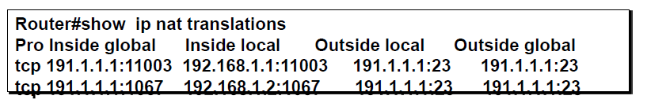

### 清除NAT转换表
`Router#clear ip nat translation`
清除NAT转换条目，这条命令只能清除动态的NAT转换条目，而无法清除静态NAT转换条目
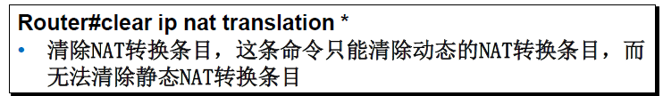
`此实验PT可以做`

### NAT的优缺点

#### NAT的优点：

- NAT节省了公有地址：通过PAT可以实现一个公网地址保证内部网络中成千上万的私有地址访问Internet
- NAT提高了内部网络的安全：NAT把网络的内部和外部隔开了，外部网络无法了解内部网络的结构，外部网络只能了解到NAT的内部全局地址，从而保证了内网的安全

#### NAT的缺点：

- NAT影响性能：NAT转换增加了数据包转发的延时，路由器必须检查每一个包来决定是否需要转换
- NAT不利于追踪：经过多次NAT，端到端的追踪变得非常困难，因为NAT的存在，很难追踪到黑客的IP地址
- NAT让网络的透明度降低，这不是网络的初衷

## DHCP技术

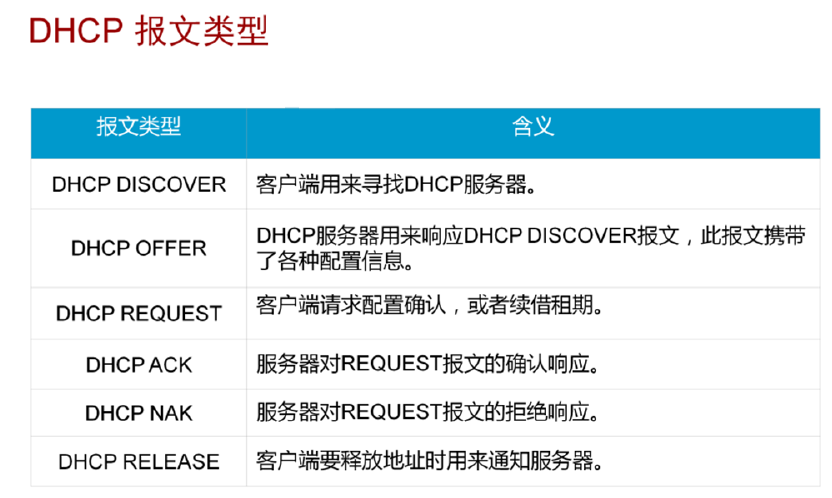
`DHCP DISCOVER` 客户端用来寻找DHCP服务器**广播形式来传播**
`DHCP OFFER` 回复一个offer,报文以**单播形式**
`DHCP REQUEST` 确认**广播形式来传播**
`DHCP ACK` 确认**单播形式**
`DHCP NAK`拒绝通知**单播形式**
`DHCP RELEASE` 释放通知**单播形式**
用到50%的时候发`DHCP REQUEST` 续租**单播**
用到还剩12.5%的时候发送`DHCP REQUEST` 续租**广播**
### DHCP工作原理

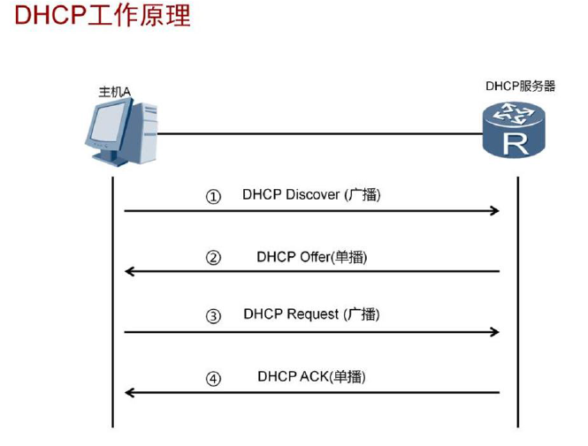
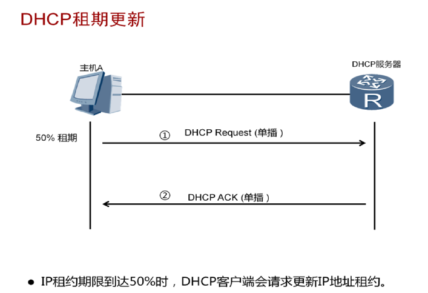
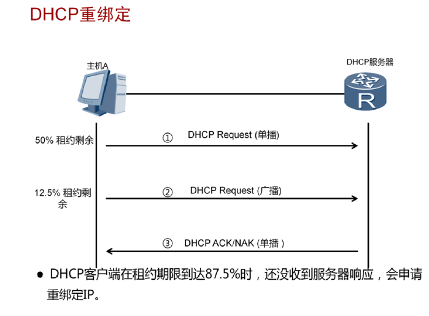
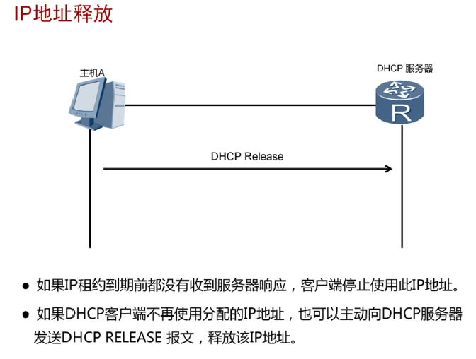

### DHCP配置

- 三层交换机或者路由器可以充当临时的DHCP服务器
- 默认情况下路由器和三层交换机都开启了DHCP服务的功能
- R1(config)#service dhcp（默认情况下开启）
```Cisco
interface f0/0
ip dhcp pool XXX ------创建地址池
network 12.1.1.0 255.255.255.0
default-router 12.1.1.1 ----配置网关
dns-server 12.1.1.1 8.8.8.8
ip dhcp exclude-address 12.1.1.1 ----排除掉12.1.1.1 //固定的地址不会分配
```
DHCP中继：接口下：`ip helper-address IP`（此IP为DHCP服务器地址）
`DHCP中继作用就是把广播变为单播`
`做中继是沿途第一个隔离广播的端口`
`前提是路由可达`
`路由器是隔离广播的`
`DHCP可以下发IP和一个网关和一个DNS`
`DHCP可以下发MAC地址绑定`

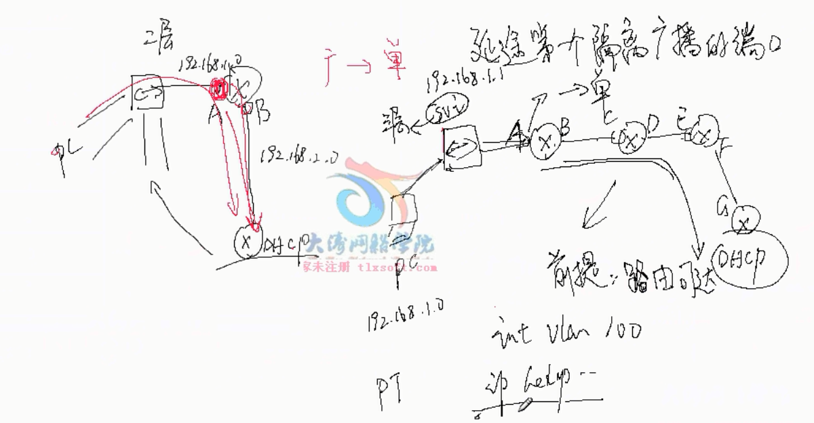
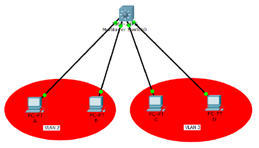
### DHCP安全


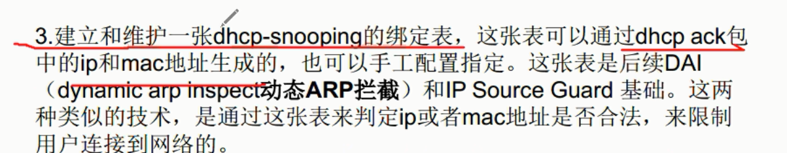
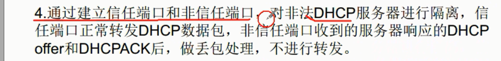
`隔绝非法DHCP server` 私接路由器
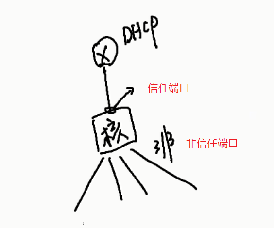

`ARP`收到ARP找到MAC
- IP源保护`IP source guard`
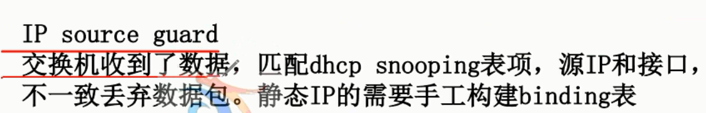