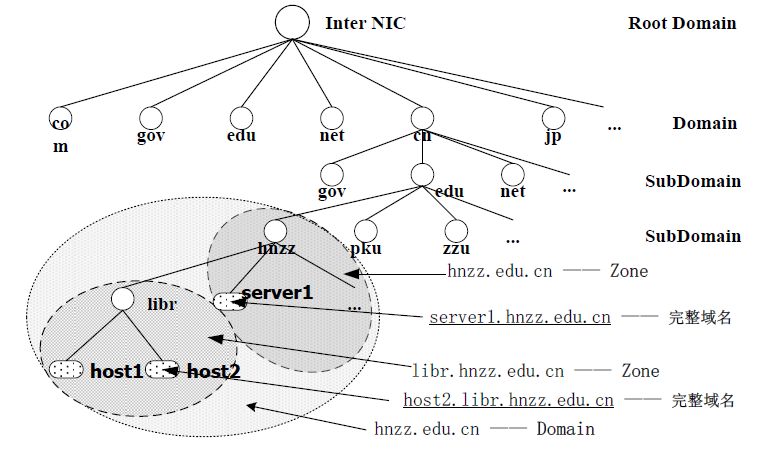
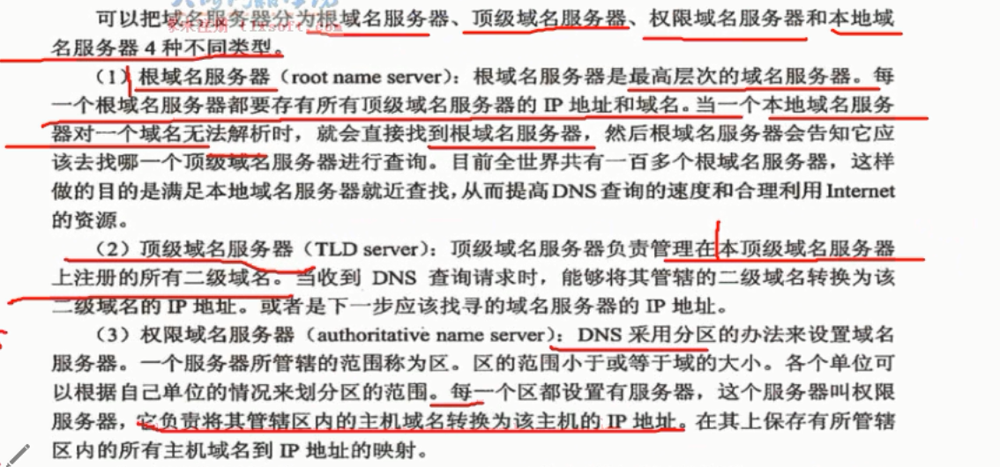
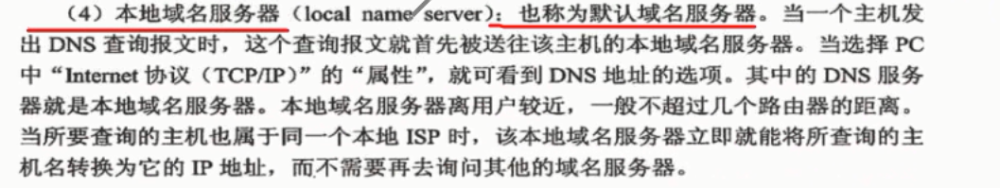
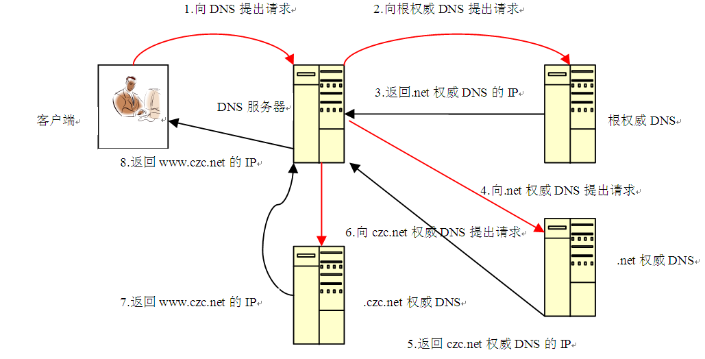

# 高级网规17课-DNS知识

## DNS的基本概念和原理

- DNS ：是域名系统（ Domain Name System  ）的缩写， 指在 Internet Internet 中使用的分配名字和地址机制。域名系 统允许用户使友好的名字 而不是难以记忆数字—— IP 地址来访问 Internet 上的主机。 在互联网上的每一个 计算机都拥有一个唯的地址，称作“ IP 地址”（即互 联网协议地址） .由于 IP 地址（为一串数字）不方便记忆， DNS 允许用户使一串常见的字母（即“域名”）取代。
- 域名解析： 就是将用户提出的名字变换成网络地址方 法和过程，从概念上讲域名解析是一个自而下的程。

### DNS 域名空间树型结构 

1. 顶级域名
   1. 顶级域名 （TLDs TLDs）是用以识别域名所属类、应范 围、注册国等公用信息的代码，又包括四种不同意义代码
      1. ISO3166 标准国家代码
      2. 专用顶级域名(或称保留顶级域名)专用顶级域名（或称保留）。共有 3个，即： “.mil” 、 “.edu ”与“ .gov ”)
      3. 通用顶级域名(）。所谓通用 顶级域名，指的是来自任何国家人均可由使用原也有 3个，即“ .com” 、“ .org” .org” 与“ .net .net”。)
   
2. 二级域名
   1. 二级域名 是指由域名使用 者自己设计的，能够体现者的特殊性,并根据以同其他人的域名相区别的字符串

### 域名服务器

### 查询模式(1)

- 当客户机需要访问 Internet 上某一主机时，首先 向**本地 DNS 服务器**查询对方 IP 地 址，往本DNS 服务器 继续向另外一台 DNS 服务器查询，直到解析出需访问主机 的IP 地址。这一过程为 “查询 ”。
- 递归查询`亲自帮你查`（ Recursive Query Recursive Query ）：客户机送出查询 请求后， DNS 服务器必须告诉客户机正确的数据（ IP 地址） 或通知客户机找不到其所需数据。如果 DNS 服务器`本地服务器`内没有 所需要的数据，则 DNS 服务器会代替客户机向其他的 DNS 服务器查询。客户机只需接触一次 DNS 服务器系统，就可 得到所需的节点地址。
  
### 查询模式(2)

- 迭代查询`踢皮球`（ Iterative Query Iterative Query ）：客户机送出查询 请求后，若该 DNS 服务器中不包含所需数据，它会向根域 名服务器发送查询请求，根域收到后告诉本地域名服务器下一步应该去查询顶级，依次类推，直到查数据否则由最后一台 DNS 服务器通 知客户机查询失败。
- 反向查询（ Reverse Query Reverse Query ）：客户机利用 IP 地址 查询其主机完整域名，即 FQDN 。

### 区域搜索类型

（1）正向搜索
已知主机的名称，查询其 IP 地址。此种请求类型使用 “名称到地址”的解析。
（2）反向搜索
已知主机的 IP 地址，查询其主机的完全合格域名。此种请类型使用"地址到名称"的解析

### DNS区域类型

- 区域是名称空间中的连续部分， DNS 服务器有权在 这部分空间上解析 DNS 查询。
- 可将 DNS 名称空间划分成几个区域，每存储 一个 或多DNS 域（或的某些部分）名称信息。对于域名，必须在DNS 中创建一个区域与之对应， Windows Server 2003 支持的区域有4种。
1. 主要区域
包含一个可读写的区域数据库文件 ，该包含一个可读写的区域数据库文件 ，该包含一个可读写的区域数据库文件 ，该记录了所有与此区域关的更新信息。每台 记录了所有与此区域关的更新信息。每台 记录了所有与此区域关的更新信息。每台 DNSDNS 服务器都必须创建一个主要区域。
2. 辅助区域
包含一个只读的区域数据库文件,与此区域有关的更改信息在被记录到主要区域文件中的同时,也被复制到辅助区域文件中.创建辅助区域,是为了创建现有区域及其区域文件的副本,从而将名称解析的工作负荷分配到多个DNS服务器上并提供容错性.
3. 存根区域
创建只含有名称服务器（ NS ）、起始授权机构 （SOA ）和主机（ A）记录的区域 副本。含有存根的服务器对该区域没有管理权.
4. 在 Active Directory 存储区域
只在 DNS 服务器是域控制时才可用。区的数据库 将保存在 Active Directory 中，进而提高了数据的安全性.

### 资源记录

资源记录是数据库表项，其中包含了计算机的属性 信息，如主机名或完全合格域（ FQDN FQDN ）、 IP 地址或 别名等。在 DNS 包的常见记录主要有以下几种:
**1. SOA(起始授权机构)**
为存储在域中的信息指明授权**起始点或初始点**。 在添加新区域时，最先创建的资源记录就是 SOA 资源记 录。该资源记中包含了若干参数，对于那些 DNS 的计 算机来说，可以根据这些参数确定区域信息的使用时间以及更新频率，判断主要服务器和次是否进行复制.
**2. NS （名称服务器）**
为区域的权威服务器或包含文件指派DNS 域名。
**3. A（主机记录）**
**包含“名称到 IP 地址”的映射**信息。用于定义网络 中的主机名称，把对应为 IP 地址。
**4. PTR （指针记录）**
定义从 IP地址到特定资源的对应,**用于方向查询**.
**5. CNAME (别名记录）**
为已在 A资源记录中指定名称的服务器提供一个附加 名称。例如，一个 Web 站点为 ata.czc.net.cn ，那么该 服务器必定有一个公用名称www.czc.net.cn （即别名）。
**6. SRV （服务）**
通过服务进行注册，客户端可以使用 DNS 查找服务。 SRV 记录可用于识别  Active Directory中的服务，所以 SRV 记录也称为“查找服务”。
**7. MX （邮件交换）**
该服务器接收电子邮件应用程序发送的。此记录必须指向该域中的邮件服务器.
