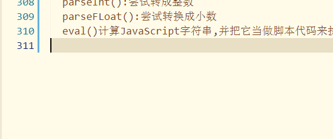

## js学习笔记
### 案例1_定时弹出广告
* 需求:
  * 打开页面后4s,展示广告,2s之后,该广告隐藏,在停2s,继续展示.
* 技术分析:
  * 定时器
  
* 定时器(BOM_window对象)

  * 执行定时器
    * setInterval(code,毫秒数):周期执行
    * setTimeout(code,毫秒数):延迟多长事件后 执行一次.
  * 清除定时器
    * clearInterval(id):
    * clearTimeout(id):
* 步骤分析:
  * 确定事件
  * 编写函数    
    * 获取元素
    * 操作元素
  #### 案例1_操作步骤
  1.html页面,先把广告隐藏
  2.页面加载成功事件 onload
  3.编写函数
    定时器:
    操作元素:
    ```html
    document.getElementById(" ")
    ```
    操作css属性
    ```html
    document.getElementById("id").style.属性="值"
    ```
    属性:就是css中属性 css属性有"-"例如:background-color
    若有"-"只需要将"-"删除,后面第一个字母变成大写即可
    注意:
    * 只要是window对象的属性和方法,可以把window省略
      * window.onload等价于onload
      * window.setInterval等价于setInterval()
  #### bom浏览器对象模型的总结
    所有的浏览器都有5个对象
    window:窗口
    location:定位信息(地址栏)
    history:历史
 #### window对象详解:
 * 如果文档包含框架(frame或iframe标签),浏览器会为HTML文档创建一个window对象,并为每个框架创建一个额外的window对象.
 * 常用的属性:
   * 通过window可以获取其他的四个对象
     * window.location等价于location
     * window.history等价于history
     * ...
   * 常用的方法
     * 消息框
       * alert("...")警告框
       * confirm("你确认要删除吗"):确定框 返回boolean
       * prompt("请输入你的姓名"):输入框  放回值:你输入的内容
     * 定时器
       * 设置定时器
         * setinterval(code,毫秒数):周期执行
         * setTimeout(code,毫秒数):延迟多长时间后,只执行一次.
         * 例如:
           *setInterval(showAd,4000);
           setInterval("showAd()",4000);
        清楚定时器
          clearInterval(id);
          clearTimeout(id);
      打开和关闭
        open(ulr):打开
        close():关闭
  location:定位信息
    * 常用属性:
      * href:获取或者设置当前页面的url(定位信息)
      * location.herf;获取url
      * location.herf="...";设置url相当于a标签
  history:历史
    back();后退
    forward();向前
      * go(int)
        * go(-1) 相当于back()
        * go(1)相当于forward()
### 案例2_表单校验plus
#### 需求:
提示信息不用弹出框,将信息追加在文本框后面
#### 技术分析
  * 确定事件,表单提交的是onsubmit
    * 文本框失去焦点的时候onblur
  * 编写函数
  * 获取元素
```html 
document.getElementById("id值");
```
  * 操作元素(获取元素的值,操作标签体,操作标签value属性)
#### 步骤分析
  1.表单
  2.提交的时候 确定事件 onsubmit()
  3.校验用户名和密码
  4.获取用户名和密码的对象值
  5.判断内容,当为空的时候,获取响应的span元素
    往span元素中显示错误纤细
    注意:
      * 在方法中(function())this指代的是当前的元素(当前dom对象)
      例如:
      <input type="text" name"username" onblur="loseFocus"(this.value)>
      方法:
      function loseFocus(obj){
        alert(obj)
      }
#### 事件总结
  常见的时间:
    焦点事件:
      * onfocus
      * onblur
    表单事件
      * onsubmit
      * onchange
    页面加载事件
      * onload
    鼠标事件(了解)
      ondbclick:双击
      onmousedown:按下
      onmouserup:弹起
      onmousemove:移动
      onmouserover:悬停
      onmouserout:移出
    键盘事件(理解)
      onkeydown:按下
      onkeyup:弹起
      onkeypress:按住
#### 绑定事件
  * 方式1:元素的事件属性
  * 方式2:派发事件
#### 了解
  阻止默认时间的发生
  阻止时间传播
#### 案例3_隔行换色
需求:一个表格,隔一行换一个色
技术分析:
  事件:onload
  获取元素:
    * document.getElementById("id"):通过id获取一个元素
    * document.getElementsTagNAme("标签名"):通过标签名获取一种元素(多个)返回一个数组
  Array:
    常用属性:
      length:数组长度
  #### 步骤分析
    1.html表格_加载的时候确定事件onload
    2.编写函数
      a.获取元素(所有的tr元素)
      b.操作(若当前行是偶数的话加一个样式,若是奇数的话,加另外一个样式)
  ```html
//页面加载成功
			onload=function(){
				//1.获取所有的tr
				var arr=document.getElementsByTagName("tr");
				//alert(arr);
				//alert(arr.length);
				
				//2.判断奇偶数 添加不同的样式 遍历数组
				for(var i=1;i<arr.length;i++){
					if(i%2==0){
						arr[i].style.backgroundColor="#FFFFCC";
					}else{
						arr[i].style.backgroundColor="#BCD68D";
					}
				}
				
			}
  ```
  #### 案例4:全选或者全部选
  步骤复习:
    1.确定事件 最上面那个复选框的单击事件 onclick
    2.编写函数:让所有的复选框和最上面的复选框状态保持一致
      a.获取最上面的复选框中的状态 通过checkbox的checked属性即可
      b.获取其他的复选框,设置他们的checked属性即可
        可以通过以下两种方案获取元素
        * document.getElementsByClassName();需要给下面所有的复选框添加class属性
        document.getElementByName();需要给下面所有的复选框添加name属性
#### dom(文档对象模型)
  当浏览器接受到html代码的时候,浏览器会所有的代码卸载到内存中,形成一棵树(document树)
  节点(Node)
    文档节点 document
    元素节点 element
    属性节点:attribute
    文本节点 text
  获取节点:
    通过document可以获取其他节点:
      常用方法:
        document.getElementById("id值"):获取一个特点的元素
        document.getElementsByTagName("标签名"):通过标签名获取一种元素(多个)
        document.getElementsByClassName("class属性的值"):通过class属性获取一类元素(多个)
        document.getElementByName("name属性值"):通过name属性获取一类元素(多个)
      设置获取节点的value属性
        dom对象.value;获取
        dom对象.value="";设置
      设置或者获取节点的标签体
        dom对象.innerHTML;获取
        dom对象.innerhtml="";设置
      获取或者设置属性
        dom对象.属性
      * 对于htmldom的操作若在js或者htmldom查找不到,去查找xml dom
        关于文档的操作 在xml dom 的document中
        关于元素的操作 在xml dom 的element中
          * appendChild(dom对象):在一个元素下添加孩子
#### 案例5_左右选中
需求:
  技术分析:
    1.确定事件,按钮的单击事件
    2.编写函数:
      点击移动单|多个的
        a.获取左边选中的选项 select对象.options--数组
          遍历数组 判断是都选中 option对象.selected
        b.将其追加到右边的下拉选项中
          rightSelected对象.appendChild(option);
      点击移动所有的  
        a.获取左边的所有的选项
        b.一个个的追加过去
#### 案例6._省市联动
需求:
  选中省的时候,动态的查询当前省下的所有市,然后展示在市的下拉选中
技术分析:
#### 数组
语法:
```js
new Array();//长度为0
new  Array(size)//指定元素长度
new Array(e1,e2...)
非官方
var arr4=["aa","bb"];
```
常用属性
  length
注意:
  数组是可变的
  数组可以存放任意值
常用方法(了解)
  存放值:对内容的操作
  pop():弹 最后一个
  push():插入到最后
  shift():删除第一个
  unshift插入到首位
  打印数组:
    join(分隔符):将数组里的元素按照指定的分割符打印
  拼接数组:
  concat():连接2个或多个数组,并返回结果
  对结构的操作:
    sort();排序
    reverse();反转
步骤分析:
  1.省的下拉选的选项的value属性 当成数组的索引
  2.初始化市
  3.选择省的时候,onchange事件
  4.编写函数
    通过获取的索引获取对象的市的数组this.value
    遍历数组,将数组里面的每个值都装option添加到select中即可
#### 引用类型的总结
  原始类型的String Number Boolean 都是伪对象,可以调用相应的方法
  Array:数组
  String:语法
    new String(值|变量);//返回一个对象
    String(值|变量);返回原始类型
    常用方法:
      substring(start,end):[start:end]
      substr(stat,size):从索引为指定的值开始向后截取几个
      charAt(index):返回在指定位置的字符
      indexOf(""):返回字符串所在的索引
      replace():替换
      split():切割
    常用属性:
      length;
  Boolean:
  * 语法:
    * new Boolean(值变量);
    * Boolean(值:变量);
    非0数字 非空字符串 非空对象 转成true
  Number
  * 语法
    new Number(值|变量);
    Number(值|变量);
    注意:
    null====>0
    fale====>0 true====>1
    字符串的数字====>对应的数字
  Date:
    new Date();
    常用方法;
      toLocalString()
  RegExp:正则表达式
  语法:
			直接量语法  /正则表达式/参数
			直接量语法  /正则表达式/
			
			new RegExp("正则表达式")
			new RegExp("正则表达式","参数") 
			参数:
				i:忽略大小写
				g:全局
			常用方法:
				test() :返回值为boolean
  https://github.com/dj199209/Python-100-Days.gitMath:
    Math.常量|方法
    Math.pI
    Math.random()[0,1)
  - 全局★
    - decodeURI()解码某个编码的URI
    - encodeURI把字符串编码为URI
    - Number():强制转换成数字
    - String():转成字符串
    - parseInt():尝试转成整数
    - parseFLoat():尝试转换成小数
    - eval()计算JavaScript字符串,并把它当做脚本代码来执行
)