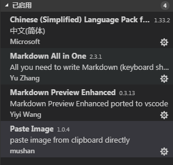
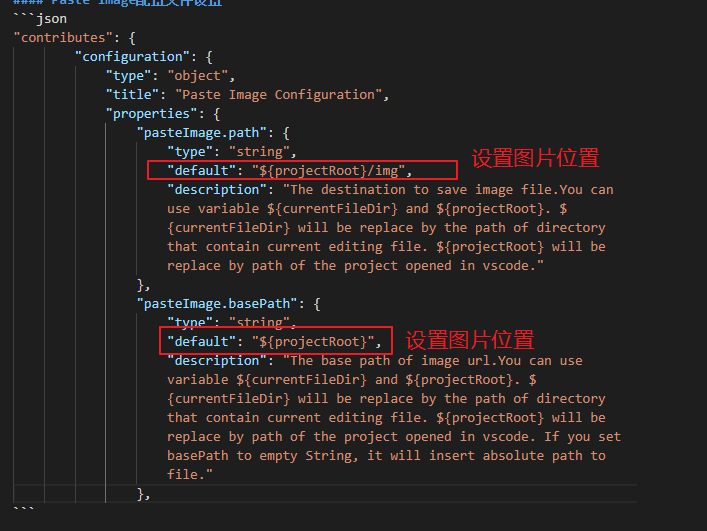

### vs_code插件安装和配置文件设置
#### 目前安装插件

#### Paste Image配置文件设置
```json
"contributes": {
		"configuration": {
			"type": "object",
			"title": "Paste Image Configuration",
			"properties": {
				"pasteImage.path": {
					"type": "string",
					"default": "${projectRoot}/img", 
					"description": "The destination to save image file.You can use variable ${currentFileDir} and ${projectRoot}. ${currentFileDir} will be replace by the path of directory that contain current editing file. ${projectRoot} will be replace by path of the project opened in vscode."
				},
				"pasteImage.basePath": {
					"type": "string",
					"default": "${projectRoot}",
					"description": "The base path of image url.You can use variable ${currentFileDir} and ${projectRoot}. ${currentFileDir} will be replace by the path of directory that contain current editing file. ${projectRoot} will be replace by path of the project opened in vscode. If you set basePath to empty String, it will insert absolute path to file."
				},
```

备注博客:https://www.jianshu.com/p/e3ff9e2928d3